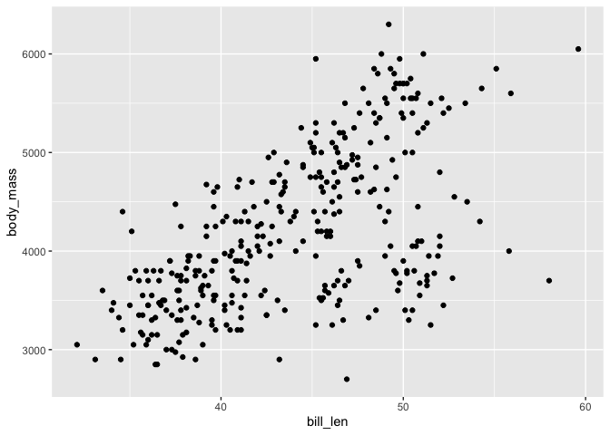
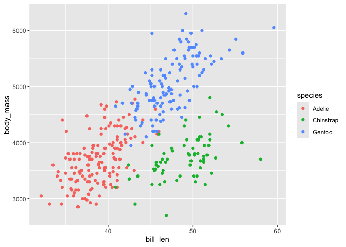
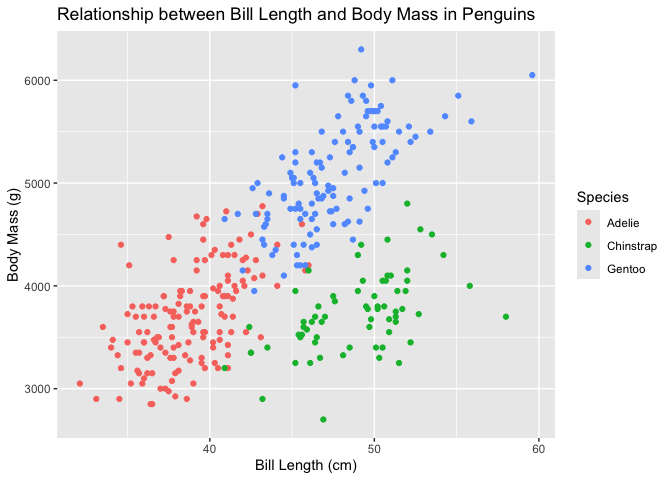

# Setup

Make sure you are in the folder you are using for the data science
assignment! If you are not, navigate to the correct folder using the
Files tab of RStudio, and select “Set As Working Directory” from the
blue gear menu. (You can also do this with `setwd()` where you give a
string variable as input,
e.g. `setwd('/Users/yourname/Desktop/ds_iai')`.)

``` r
# wd = working directory 
getwd() # where are we working from?
```

    ## [1] "/Users/sxmorgan/Library/Mobile Documents/com~apple~CloudDocs/_PARA/PROJECTS/r-course-iai-lucid/rmd-exercises"

``` r
?getwd # loads the function help 
```

The chunk below is the code from Brightspace to install the required
packages. BEFORE you run it: please make a folder the “Files” tab in the
bottom right of RStudio is a folder where you will work out of for the
assignment. In class we made one called `ds_iai` and opened a new R
Markdown file inside it.

``` r
# attach the groundhog package, to activate taking a "snapshot" of versions
library(groundhog)
```

    ## groundhog says: No default repository found, setting to 'http://cran.r-project.org/'

    ## Attached: 'Groundhog' (Version: 3.2.3)

    ## Tips and troubleshooting: https://groundhogR.com

``` r
# 2.3 pick october 1st as a common reference date and install the packages
groundhog.library(c('here','tidyverse'), "2025-10-01")
```

    ## here() starts at /Users/sxmorgan/Library/Mobile Documents/com~apple~CloudDocs/_PARA/PROJECTS/r-course-iai-lucid

    ## ── Attaching core tidyverse packages ──────────────────────── tidyverse 2.0.0 ──
    ## ✔ dplyr     1.1.4     ✔ readr     2.1.5
    ## ✔ forcats   1.0.1     ✔ stringr   1.5.2
    ## ✔ ggplot2   4.0.0     ✔ tibble    3.3.0
    ## ✔ lubridate 1.9.4     ✔ tidyr     1.3.1
    ## ✔ purrr     1.1.0     
    ## ── Conflicts ────────────────────────────────────────── tidyverse_conflicts() ──
    ## ✖ dplyr::filter() masks stats::filter()
    ## ✖ dplyr::lag()    masks stats::lag()
    ## ℹ Use the conflicted package (<http://conflicted.r-lib.org/>) to force all conflicts to become errors
    ## Successfully attached 'here_1.0.2'
    ## 
    ## Successfully attached 'tidyverse_2.0.0'

``` r
# if you had issues with groundhog
# library(tidyverse)
# library(here)
# sessionInfo()
```

# Exercises: Penguins (Data Frames & Visualizations)

Tip: you may want to copy these into a new R Markdown document to avoid
lots of scrolling…

Use the same verbs and plotting steps from today: `select()`,
`filter()`, `mutate()`, `arrange()`, and `ggplot()` + `geom_xxx()` +
`labs()`.

It’s OK if plots print messages about removed rows — the dataset has
some missing values.

## 1) Quick scan (structure & missingness)

1.1 First, save the `penguins` dataset as a tibble to a variable name of
your choosing.

1.2 How many rows/columns are in `penguins`?

- Answer: 344 rows and 8 cols

1.3 Which variables are numeric vs. categorical?

- Numeric (int and dbl): `bill_len`,
  `bill_dep`,`flipper_len`,`body_mass`,`year`
- Categorical: `species`,`island`,`sex`

1.4 Which columns visibly include missing (NA) values?

``` r
# head(penguins)

# 1.1 
# since the penguins data frame does not have rownames, we can directly make it a tibble
peng <- tibble(penguins)

# 1.2 & 1.3 & 1.4
# we can already read the number of rows and columns and the variable types when we print a tibble
# we can also see the 4th row observation has some missing data, and some others are missing male/female info
peng
```

    ## # A tibble: 344 × 8
    ##    species island    bill_len bill_dep flipper_len body_mass sex     year
    ##    <fct>   <fct>        <dbl>    <dbl>       <int>     <int> <fct>  <int>
    ##  1 Adelie  Torgersen     39.1     18.7         181      3750 male    2007
    ##  2 Adelie  Torgersen     39.5     17.4         186      3800 female  2007
    ##  3 Adelie  Torgersen     40.3     18           195      3250 female  2007
    ##  4 Adelie  Torgersen     NA       NA            NA        NA <NA>    2007
    ##  5 Adelie  Torgersen     36.7     19.3         193      3450 female  2007
    ##  6 Adelie  Torgersen     39.3     20.6         190      3650 male    2007
    ##  7 Adelie  Torgersen     38.9     17.8         181      3625 female  2007
    ##  8 Adelie  Torgersen     39.2     19.6         195      4675 male    2007
    ##  9 Adelie  Torgersen     34.1     18.1         193      3475 <NA>    2007
    ## 10 Adelie  Torgersen     42       20.2         190      4250 <NA>    2007
    ## # ℹ 334 more rows

``` r
# 1.2 alternative: the dim (dimension) function
dim(peng)
```

    ## [1] 344   8

``` r
# 1.3 alternative: selectors (more advanced)
select(peng, where(is.numeric))
```

    ## # A tibble: 344 × 5
    ##    bill_len bill_dep flipper_len body_mass  year
    ##       <dbl>    <dbl>       <int>     <int> <int>
    ##  1     39.1     18.7         181      3750  2007
    ##  2     39.5     17.4         186      3800  2007
    ##  3     40.3     18           195      3250  2007
    ##  4     NA       NA            NA        NA  2007
    ##  5     36.7     19.3         193      3450  2007
    ##  6     39.3     20.6         190      3650  2007
    ##  7     38.9     17.8         181      3625  2007
    ##  8     39.2     19.6         195      4675  2007
    ##  9     34.1     18.1         193      3475  2007
    ## 10     42       20.2         190      4250  2007
    ## # ℹ 334 more rows

``` r
# if you want to return the exact vector of answers
select(peng, where(is.numeric)) |> colnames()
```

    ## [1] "bill_len"    "bill_dep"    "flipper_len" "body_mass"   "year"

``` r
# 1.4 alternative (more thorough, using is.na() and filter() functions)
# check a few specific variables for missing values using the OR operator (a vertical bar: |)
filter(peng, is.na(sex) | is.na(bill_len) | is.na(flipper_len))
```

    ## # A tibble: 11 × 8
    ##    species island    bill_len bill_dep flipper_len body_mass sex    year
    ##    <fct>   <fct>        <dbl>    <dbl>       <int>     <int> <fct> <int>
    ##  1 Adelie  Torgersen     NA       NA            NA        NA <NA>   2007
    ##  2 Adelie  Torgersen     34.1     18.1         193      3475 <NA>   2007
    ##  3 Adelie  Torgersen     42       20.2         190      4250 <NA>   2007
    ##  4 Adelie  Torgersen     37.8     17.1         186      3300 <NA>   2007
    ##  5 Adelie  Torgersen     37.8     17.3         180      3700 <NA>   2007
    ##  6 Adelie  Dream         37.5     18.9         179      2975 <NA>   2007
    ##  7 Gentoo  Biscoe        44.5     14.3         216      4100 <NA>   2007
    ##  8 Gentoo  Biscoe        46.2     14.4         214      4650 <NA>   2008
    ##  9 Gentoo  Biscoe        47.3     13.8         216      4725 <NA>   2009
    ## 10 Gentoo  Biscoe        44.5     15.7         217      4875 <NA>   2009
    ## 11 Gentoo  Biscoe        NA       NA            NA        NA <NA>   2009

``` r
# 1.4 alternative (VERY advanced, not taught or expected of you, given as example)
# prints the exact number of NAs in each column
summarise(peng, across(everything(), ~ sum(is.na(.x))))
```

    ## # A tibble: 1 × 8
    ##   species island bill_len bill_dep flipper_len body_mass   sex  year
    ##     <int>  <int>    <int>    <int>       <int>     <int> <int> <int>
    ## 1       0      0        2        2           2         2    11     0

``` r
# translation: "for each column of peng, sum up the number of observations/rows which are NA"
```

## 2) Focus on one species (filter, select, arrange)

2.1 Keep only Adelie rows; store as `adelie_tbl`.

2.2 Keep only: `bill_len`, `bill_dep`, `flipper_len`, `body_mass`,
`year`.

2.3 Sort descending by `body_mass`.

2.4 Question: about how many Adelie penguins are over 4000 g?

``` r
# 2.1 
adelie_tbl <- filter(peng, species == "Adelie") |>
  # 2.2
  select(bill_len, bill_dep, flipper_len, body_mass, year) |>
  # 2.3
  arrange(desc(body_mass))

# 2.4 
filter(adelie_tbl) |>
  filter(body_mass > 4000) |>
  nrow() # returns the number of rows (not the whole tibble)
```

    ## [1] 35

## 3) Derived variable (mutate)


3.1 In `adelie_tbl`, create `bill_ratio` = `bill_len` / `bill_dep`.

3.2 Sort by `bill_ratio` (largest first).

3.3 Question: what does a larger `bill_ratio` suggest?

- Answer: mathematically, a larger `bill_ratio` suggests that `bill_len`
  is relatively larger than `bill_dep`. You can observe this in the
  table with `view(adelie_tbl)`.

``` r
# 3.1
adelie_tbl <- adelie_tbl |>
  mutate(bill_ratio = bill_len / bill_dep)

# 3.2
# largest first = descending 
arrange(adelie_tbl, desc(bill_ratio))
```

    ## # A tibble: 152 × 6
    ##    bill_len bill_dep flipper_len body_mass  year bill_ratio
    ##       <dbl>    <dbl>       <int>     <int> <int>      <dbl>
    ##  1     44.1     18           210      4000  2009       2.45
    ##  2     42.9     17.6         196      4700  2008       2.44
    ##  3     40.9     16.8         191      3700  2008       2.43
    ##  4     45.8     18.9         197      4150  2008       2.42
    ##  5     40.7     17           190      3725  2009       2.39
    ##  6     39.5     16.7         178      3250  2007       2.37
    ##  7     40.2     17           176      3450  2009       2.36
    ##  8     40.6     17.2         187      3475  2009       2.36
    ##  9     37.7     16           183      3075  2009       2.36
    ## 10     40.2     17.1         193      3400  2009       2.35
    ## # ℹ 142 more rows

``` r
# 3.3
# explore (opens a new tab in RStudio with the full tibble, not just first 10 rows)
# view(adelie_tbl)
```

## 4) Relationship plot (scatter)

4.1 Make a scatter plot of bill length vs body mass.

- You will get a warning that there are missing values – that’s okay, we
  knew about them

4.2 Color points by species.

4.3 Add a clear title and axis labels with labs().

4.4 Save your image to the results folder we made and use a descriptive
name (or the folder you’re working in if you didn’t want to or manage to
create a results folder!)

``` r
# 4.1
# go back to the full dataset, not just adelie penguins
peng |>
  ggplot(aes(x = bill_len, y = body_mass)) +
  geom_point()
```

    ## Warning: Removed 2 rows containing missing values or values outside the scale range
    ## (`geom_point()`).

<!-- -->

``` r
# 4.2
peng |>
  ggplot(aes(x = bill_len, y = body_mass)) +
  geom_point(aes(color = species))
```

    ## Warning: Removed 2 rows containing missing values or values outside the scale range
    ## (`geom_point()`).

<!-- -->

``` r
# 4.3
final_plot <- peng |>
  ggplot(aes(x = bill_len, y = body_mass)) +
  geom_point(aes(color = species)) +
  labs(title = "Relationship between Bill Length and Body Mass in Penguins",
       x = "Bill Length (cm)", y = "Body Mass (g)",
       color = "Species")

final_plot
```

    ## Warning: Removed 2 rows containing missing values or values outside the scale range
    ## (`geom_point()`).

<!-- -->

``` r
# 4.4
# saving something that doesn't exist means we need to make a filename
# fn has to end in what we want to call the new file

# using here to generate a filename -- below only works if you already made a results folder!
fn <- here('results','penguin_scatter.png')
# if you didn't or got stuck on making the results folder, instead try:
fn <- here('penguin_scatter.png') # should save to the working directory, ie the assignment folder we're in

ggsave(filename = fn, 
       plot = final_plot)
```

    ## Saving 7 x 5 in image

    ## Warning: Removed 2 rows containing missing values or values outside the scale range
    ## (`geom_point()`).

``` r
# check out the help
?ggsave
```

``` r
# it's good practice to end a document like this with the sessionInfo() function
# it produces a snapshot of the RStudio/computing environment and can also be very useful if you're having issues with packages, versions, etc
sessionInfo()
```

    ## R version 4.5.1 (2025-06-13)
    ## Platform: aarch64-apple-darwin20
    ## Running under: macOS Sequoia 15.6.1
    ## 
    ## Matrix products: default
    ## BLAS:   /Library/Frameworks/R.framework/Versions/4.5-arm64/Resources/lib/libRblas.0.dylib 
    ## LAPACK: /Library/Frameworks/R.framework/Versions/4.5-arm64/Resources/lib/libRlapack.dylib;  LAPACK version 3.12.1
    ## 
    ## locale:
    ## [1] en_US.UTF-8/en_US.UTF-8/en_US.UTF-8/C/en_US.UTF-8/en_US.UTF-8
    ## 
    ## time zone: Europe/Amsterdam
    ## tzcode source: internal
    ## 
    ## attached base packages:
    ## [1] stats     graphics  grDevices utils     datasets  methods   base     
    ## 
    ## other attached packages:
    ##  [1] lubridate_1.9.4 forcats_1.0.1   stringr_1.5.2   dplyr_1.1.4    
    ##  [5] purrr_1.1.0     readr_2.1.5     tidyr_1.3.1     tibble_3.3.0   
    ##  [9] ggplot2_4.0.0   tidyverse_2.0.0 here_1.0.2      groundhog_3.2.3
    ## 
    ## loaded via a namespace (and not attached):
    ##  [1] gtable_0.3.6       compiler_4.5.1     tidyselect_1.2.1   parallel_4.5.1    
    ##  [5] textshaping_1.0.3  systemfonts_1.3.0  scales_1.4.0       yaml_2.3.10       
    ##  [9] fastmap_1.2.0      R6_2.6.1           labeling_0.4.3     generics_0.1.4    
    ## [13] knitr_1.50         rprojroot_2.1.1    pillar_1.11.1      RColorBrewer_1.1-3
    ## [17] tzdb_0.5.0         rlang_1.1.6        utf8_1.2.6         stringi_1.8.7     
    ## [21] xfun_0.53          S7_0.2.0           timechange_0.3.0   cli_3.6.5         
    ## [25] withr_3.0.2        magrittr_2.0.4     digest_0.6.37      grid_4.5.1        
    ## [29] rstudioapi_0.17.1  hms_1.1.3          lifecycle_1.0.4    vctrs_0.6.5       
    ## [33] evaluate_1.0.5     glue_1.8.0         farver_2.1.2       ragg_1.5.0        
    ## [37] rmarkdown_2.30     tools_4.5.1        pkgconfig_2.0.3    htmltools_0.5.8.1
