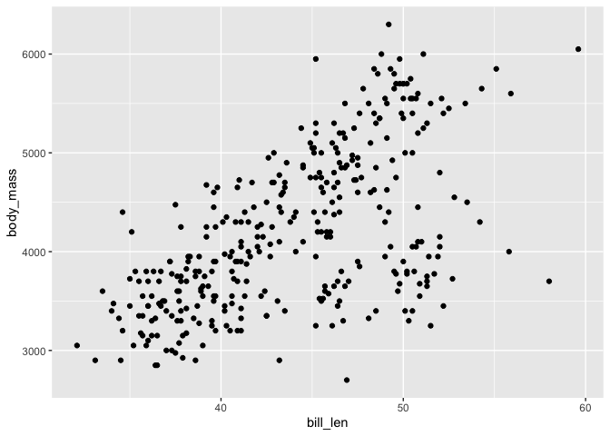
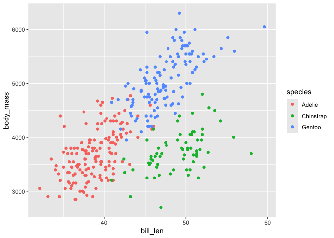
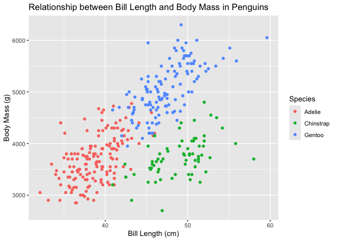

> **Contents:** set up folders, load packages, introduction to R
> variables and data structures, data frames and tibbles, key data
> manipulation verbs (`select`, `filter`, `mutate`, and `arrange`), and
> some basic plots.

> Scroll to the bottom for the exercises.

# 0. Setup

Make sure you are in the folder you are using for the data science
assignment! If you are not, navigate to the correct folder using the
Files tab of RStudio, and select “Set As Working Directory” from the
blue gear menu. (You can also do this with `setwd()` where you give a
string variable as input,
e.g. `setwd('/Users/yourname/Desktop/ds_iai')`.)

``` r
# wd = working directory 
getwd() # where are we working from?
```

    ## [1] "/Users/sxmorgan/Desktop/ds_iai/rmd-code-notebooks"

``` r
?getwd # loads the function help 
```

The chunk below is the code from Brightspace to install the required
packages. BEFORE you run it: please make a folder the “Files” tab in the
bottom right of RStudio is a folder where you will work out of for the
assignment. In class we made one called `ds_iai` and opened a new R
Markdown file inside it.

``` r
# 2.1 install the groundhog package and other packages needed for the course
# install.packages('groundhog', version = '3.2.3')
# install.packages('tidyverse', version = '2.0.0')
# install.packages('here', version = '1.0.2')

# 2.2. attach the groundhog package, to activate taking a "snapshot" of versions
library(groundhog)
```

    ## groundhog says: No default repository found, setting to 'http://cran.r-project.org/'

    ## Attached: 'Groundhog' (Version: 3.2.3)

    ## Tips and troubleshooting: https://groundhogR.com

``` r
# 2.3 pick october 1st as a common reference date and install the packages
groundhog.library(c('here','tidyverse'), "2025-10-01")
```

    ## here() starts at /Users/sxmorgan/Desktop/ds_iai

    ## ── Attaching core tidyverse packages ──────────────────────── tidyverse 2.0.0 ──
    ## ✔ dplyr     1.1.4     ✔ readr     2.1.5
    ## ✔ forcats   1.0.1     ✔ stringr   1.5.2
    ## ✔ ggplot2   4.0.0     ✔ tibble    3.3.0
    ## ✔ lubridate 1.9.4     ✔ tidyr     1.3.1
    ## ✔ purrr     1.1.0     
    ## ── Conflicts ────────────────────────────────────────── tidyverse_conflicts() ──
    ## ✖ dplyr::filter() masks stats::filter()
    ## ✖ dplyr::lag()    masks stats::lag()
    ## ℹ Use the conflicted package (<http://conflicted.r-lib.org/>) to force all conflicts to become errors
    ## Successfully attached 'here_1.0.2'
    ## 
    ## Successfully attached 'tidyverse_2.0.0'

Some of you had issues with the `groundhog` package. If that’s you:
please forget about the `groundhog` package. As long as you have the
`tidyverse` and `here` packages installed (and your versions aren’t
really old) – you should be fine. Try uncommenting and running the code
below if you’re (still) having issues.

``` r
# if that still doesn't work: just make sure you have the tidyverse and here packages installed
# install.packages('tidyverse', version = '2.0.0')
# install.packages('here', version = '1.0.2')

# and in the very worst case, try without the version argument, and then use sessionInfo() to check what version you use
# library(tidyverse)
# library(here)
# sessionInfo()
```

# 1. Variables and vectors

There are several “types” of variables in R,

- `chr`: characters or “strings”
- `num`: numeric, can be either integers (1, 2, 3) or double (1, 1.21),
  sometimes called a “continuous” variable
- `fct`: factor, a categorical variable which can be chr or num type!
  sometimes called a “discrete” variable
- `lgl`: boolean, value can be either true or false

We’ll explore these more when we look at real clinical patient data in
the next days.

``` r
x <- "hello" # single string, saved as x
y <- c("my", "first", "vector") # vector of strings, saved as y
z <- c(1, 2, 8, 4) # vector of integers (num), saved as z

# how are factors different than numeric vectors
w <- as_factor(z)
# alternatively:
# w <- factor(z, levels = sort(z))
# bonus: how is the line (function) below different from those above, and why would we (generally) prefer those above?
# w <- as.factor(z)

# how to learn about your variables
typeof(x)
```

    ## [1] "character"

``` r
class(x)
```

    ## [1] "character"

``` r
typeof(z)
```

    ## [1] "double"

``` r
length(y)
```

    ## [1] 3

``` r
levels(w)
```

    ## [1] "1" "2" "4" "8"

``` r
# how to find help
?mean
help.search("median")
```

PS: in general, it’s better to give variables informative names! (Not x
and y)

# 2. Operators and functions

Operators and functions are two critical concepts to “do” things in R.
Operators are symbols that perform specific actions, while functions are
named commands that take inputs (called “arguments”) in parentheses, and
do more complex tasks.

We started the coding demo on day 1 with a function – `getwd()`. The
five lines under “\# how to learn about your variables” in the code
chunk above are also functions.

We also discussed a few operators, which you’ll be comfortable with by
the end of the assignment:

- the assignment operator is a backwards arrow used to assign things
  (`variable_name <- variable_value`)
- the pipe operator is used to chain or combine multiple functions can
  either be %\>% or \|\>
- the plus operator is used after a `ggplot()` function has been invoked
  to add plot options (layers, as we’ll call them later)

``` r
# basic functions for numeric vectors
z_mean <- mean(z)
z_med <- median(z)

# print
z_mean
```

    ## [1] 3.75

``` r
z_med
```

    ## [1] 3

``` r
# these both give warnings, why?
mean(y) 
```

    ## Warning in mean.default(y): argument is not numeric or logical: returning NA

    ## [1] NA

``` r
mean(w) 
```

    ## Warning in mean.default(w): argument is not numeric or logical: returning NA

    ## [1] NA

``` r
# putting it all together
weights <- c(23.5, 24.1, 23.8, 24.3)  # <- is the assignment operator
average_weight <- mean(weights)       # mean() is a function
difference <- 24.5 - average_weight   # - is the subtraction operator
```

Tip: one final operator that is less common (not part of this
assignment) but useful to know in R is the :: operator. It is used to
invoke a function from a specific package. For example, instead of
loading the `here` package (`library(here)`) and then calling the
`here()` function, you could just type `here::here()` and R will pull
the right function.

# 3. Data frames and tibbles

Data frames are the most common data structure you’ll encounter doing
real data analysis in R – think of it as the R version of an Excel
table. It is similar to a matrix in that it also has row and column
attributes, but different in that its columns, for example, can be of
multiple data types (only 1 for matrices).

There are several built-in datasets in R: `mtcars` (cars) and `iris`
(flowers) are two of the most popular. In class and in the example we
worked with `mtcars` – complete the chunks below with `iris` for a bit
more of a challenge.

``` r
# We'll start with a built-in dataset (a data.frame)
df <- mtcars
# df <- iris

# prints the first 6 rows of any data frame object
head(df)
```

    ##                    mpg cyl disp  hp drat    wt  qsec vs am gear carb
    ## Mazda RX4         21.0   6  160 110 3.90 2.620 16.46  0  1    4    4
    ## Mazda RX4 Wag     21.0   6  160 110 3.90 2.875 17.02  0  1    4    4
    ## Datsun 710        22.8   4  108  93 3.85 2.320 18.61  1  1    4    1
    ## Hornet 4 Drive    21.4   6  258 110 3.08 3.215 19.44  1  0    3    1
    ## Hornet Sportabout 18.7   8  360 175 3.15 3.440 17.02  0  0    3    2
    ## Valiant           18.1   6  225 105 2.76 3.460 20.22  1  0    3    1

``` r
# accession with [row, column] indices, starting at 1, not 0
df[1,1]
```

    ## [1] 21

``` r
# other things to look at 
dim(df)
```

    ## [1] 32 11

``` r
rownames(df)
```

    ##  [1] "Mazda RX4"           "Mazda RX4 Wag"       "Datsun 710"         
    ##  [4] "Hornet 4 Drive"      "Hornet Sportabout"   "Valiant"            
    ##  [7] "Duster 360"          "Merc 240D"           "Merc 230"           
    ## [10] "Merc 280"            "Merc 280C"           "Merc 450SE"         
    ## [13] "Merc 450SL"          "Merc 450SLC"         "Cadillac Fleetwood" 
    ## [16] "Lincoln Continental" "Chrysler Imperial"   "Fiat 128"           
    ## [19] "Honda Civic"         "Toyota Corolla"      "Toyota Corona"      
    ## [22] "Dodge Challenger"    "AMC Javelin"         "Camaro Z28"         
    ## [25] "Pontiac Firebird"    "Fiat X1-9"           "Porsche 914-2"      
    ## [28] "Lotus Europa"        "Ford Pantera L"      "Ferrari Dino"       
    ## [31] "Maserati Bora"       "Volvo 142E"

``` r
# glimpse is a useful function, especially for data frames which do not give an overview of variable types
glimpse(df)
```

    ## Rows: 32
    ## Columns: 11
    ## $ mpg  <dbl> 21.0, 21.0, 22.8, 21.4, 18.7, 18.1, 14.3, 24.4, 22.8, 19.2, 17.8,…
    ## $ cyl  <dbl> 6, 6, 4, 6, 8, 6, 8, 4, 4, 6, 6, 8, 8, 8, 8, 8, 8, 4, 4, 4, 4, 8,…
    ## $ disp <dbl> 160.0, 160.0, 108.0, 258.0, 360.0, 225.0, 360.0, 146.7, 140.8, 16…
    ## $ hp   <dbl> 110, 110, 93, 110, 175, 105, 245, 62, 95, 123, 123, 180, 180, 180…
    ## $ drat <dbl> 3.90, 3.90, 3.85, 3.08, 3.15, 2.76, 3.21, 3.69, 3.92, 3.92, 3.92,…
    ## $ wt   <dbl> 2.620, 2.875, 2.320, 3.215, 3.440, 3.460, 3.570, 3.190, 3.150, 3.…
    ## $ qsec <dbl> 16.46, 17.02, 18.61, 19.44, 17.02, 20.22, 15.84, 20.00, 22.90, 18…
    ## $ vs   <dbl> 0, 0, 1, 1, 0, 1, 0, 1, 1, 1, 1, 0, 0, 0, 0, 0, 0, 1, 1, 1, 1, 0,…
    ## $ am   <dbl> 1, 1, 1, 0, 0, 0, 0, 0, 0, 0, 0, 0, 0, 0, 0, 0, 0, 1, 1, 1, 0, 0,…
    ## $ gear <dbl> 4, 4, 4, 3, 3, 3, 3, 4, 4, 4, 4, 3, 3, 3, 3, 3, 3, 4, 4, 4, 3, 3,…
    ## $ carb <dbl> 4, 4, 1, 1, 2, 1, 4, 2, 2, 4, 4, 3, 3, 3, 4, 4, 4, 1, 2, 1, 1, 2,…

The tidyverse has its own “class” or type of data frame (named after the
package it comes from) that we discussed: a `tibble`. This is
functionally equivalent to a data frame, but it makes viewing a little
more pleasant (especially in the console), which will become important
once we get into “bigger” data in the coming days.

Data frames have rownames and tibbles don’t! So if a data frame has
information contained in its rownames which we would like to keep, we
have to first use a special command, `rownames_to_column()` when saving
one of the built-in datasets as a variable.

``` r
# why not this?
# cars <- as_tibble(df)

# correct way
cars <- df |> 
  # "take the rownames and turn them into a variable named car_model"
  rownames_to_column(var = "car_model") |>
  # then make the data frame into a tibble class object
  as_tibble()

# no need to use head() to print a tibble - it always prints the first 10 rows and that's it
cars
```

    ## # A tibble: 32 × 12
    ##    car_model     mpg   cyl  disp    hp  drat    wt  qsec    vs    am  gear  carb
    ##    <chr>       <dbl> <dbl> <dbl> <dbl> <dbl> <dbl> <dbl> <dbl> <dbl> <dbl> <dbl>
    ##  1 Mazda RX4    21       6  160    110  3.9   2.62  16.5     0     1     4     4
    ##  2 Mazda RX4 …  21       6  160    110  3.9   2.88  17.0     0     1     4     4
    ##  3 Datsun 710   22.8     4  108     93  3.85  2.32  18.6     1     1     4     1
    ##  4 Hornet 4 D…  21.4     6  258    110  3.08  3.22  19.4     1     0     3     1
    ##  5 Hornet Spo…  18.7     8  360    175  3.15  3.44  17.0     0     0     3     2
    ##  6 Valiant      18.1     6  225    105  2.76  3.46  20.2     1     0     3     1
    ##  7 Duster 360   14.3     8  360    245  3.21  3.57  15.8     0     0     3     4
    ##  8 Merc 240D    24.4     4  147.    62  3.69  3.19  20       1     0     4     2
    ##  9 Merc 230     22.8     4  141.    95  3.92  3.15  22.9     1     0     4     2
    ## 10 Merc 280     19.2     6  168.   123  3.92  3.44  18.3     1     0     4     4
    ## # ℹ 22 more rows

## Core data manipulation functions

Now think back to an Excel table – what are some things you do with one
of those when you’re looking for something? Think of some verbs, imagine
typing those instructions out to someone… The `tidyverse` functions for
manipulating data in R are designed to be intuitive.

The core four from the `dplyr` package within the `tidyverse`:

- `select()` selects whichever columns you tell it, either by name or
  index (number)
- `filter()` filters based on whatever criteria you give it (based on
  the columns you actually have or make)
- `mutate()` changes existing columns or creates new ones (think of
  calculations and transformations, etc)
- `arrange()` arranges or sorts the visual output based on whichever
  column(s) you give it

Often, we will use these in combination with one another, and/or one
after another, which is why the pipe operator (\|\> or %\>%) becomes so
handy.

Fun fact: the pipe operator is possible because the functions we will
learn in the `tidyverse` are standardized to take data frames as the
first argument (input variable). (Confirm this by typing `?select`,
what’s the first argument)

``` r
# select/filter/mutate examples - play around with these!
df_small <- cars |>
  select(car_model, mpg, cyl, hp) |>
  filter(cyl %in% c(4, 6)) |>
  # right now, cyl is a number so we can also do:
  # filter(cyl <= 6) |> 
  mutate(hp_per_cyl = hp / cyl) |>
  arrange(desc(hp))

df_small |> select(car_model, hp_per_cyl, everything())
```

    ## # A tibble: 18 × 5
    ##    car_model      hp_per_cyl   mpg   cyl    hp
    ##    <chr>               <dbl> <dbl> <dbl> <dbl>
    ##  1 Ferrari Dino         29.2  19.7     6   175
    ##  2 Merc 280             20.5  19.2     6   123
    ##  3 Merc 280C            20.5  17.8     6   123
    ##  4 Lotus Europa         28.2  30.4     4   113
    ##  5 Mazda RX4            18.3  21       6   110
    ##  6 Mazda RX4 Wag        18.3  21       6   110
    ##  7 Hornet 4 Drive       18.3  21.4     6   110
    ##  8 Volvo 142E           27.2  21.4     4   109
    ##  9 Valiant              17.5  18.1     6   105
    ## 10 Toyota Corona        24.2  21.5     4    97
    ## 11 Merc 230             23.8  22.8     4    95
    ## 12 Datsun 710           23.2  22.8     4    93
    ## 13 Porsche 914-2        22.8  26       4    91
    ## 14 Fiat 128             16.5  32.4     4    66
    ## 15 Fiat X1-9            16.5  27.3     4    66
    ## 16 Toyota Corolla       16.2  33.9     4    65
    ## 17 Merc 240D            15.5  24.4     4    62
    ## 18 Honda Civic          13    30.4     4    52

# 4. The most important types of plots

Data visualization only got a very brief intro on Day 1. It will get its
own formal introduction on and be the focus of Day 2, so this section
and the next are more preparatory than anything.

First, let’s create a folder (named results or whatever you’d like to
call it) inside of the folder we are working in for the assignment,
using the `here()` function to build up a filepath string.

``` r
# the here function finds the folder you are currently in (like getwd())
here()
```

    ## [1] "/Users/sxmorgan/Desktop/ds_iai"

``` r
# it also takes the strings that you give it and pastes them together to make a proper filename for your computer
results_path <- here('results') # one folder
results_path <- here('results','day-1') # subfolder, may need to add recursive=TRUE to dir.create

# bonus: try timestamping your folders
# results_path <- here('results', lubridate::today())

# whatever you decide to call it, check that results_path is a real filepath on your computer and in your current working directory, then create it
dir.create(results_path)
```

    ## Warning in dir.create(results_path):
    ## '/Users/sxmorgan/Desktop/ds_iai/results/day-1' already exists

How to plot our data? First, need to ask what you would like to show
(more on this to come)…

1.  Relationship? =\> scatter plot with `geom_point()`
2.  Distribution? =\> histogram with `geom_histogram()` or
    `geom_density()`
3.  Comparison? =\> boxplot with `geom_boxplot()`
4.  Composition? =\> stacked bar with `geom_bar()`

Check out the cheatsheet for more options and details:
<https://posit.co/wp-content/uploads/2022/10/data-visualization-1.pdf>

In the following chunk, play around with colors and shapes (use the help
to figure out how if needed!)

``` r
# to visualize distribution of numeric variables: geom_histogram
df |>
  ggplot(aes(x = mpg)) +
  geom_histogram(bins = 20) +
  labs(title = "Distribution of MPG")
```

<!-- -->

``` r
# to visualize distribution of categorical variables: geom_bar (not stacked)
df |>
  # mutate(am = as_factor(am)) |>
  ggplot(aes(x = am)) +
  geom_bar() +
  labs(title = "Distribution of Transmission Types")
```

<!-- -->

``` r
# Boxplot of mpg by cylinders (+ jittered points)
df |>
  ggplot(aes(x = factor(cyl), y = mpg)) +
  geom_boxplot() +
  geom_point() +
  # geom_jitter(width = 0.2, alpha = 0.6) + 
  labs(x = "Cylinders", y = "MPG", title = "MPG by Cylinder Count")
```

<!-- -->

``` r
# Scatter (no smoothing)
# in class we colored by cyl, which we made a factor -- try that on your own here
df |>
  ggplot(aes(x = hp, y = mpg)) +
  geom_point() + #scatter plots are ALWAYS geom_point() not geom_jitter()
  labs(x = "Horsepower", y = "MPG", title = "MPG vs Horsepower") +
  theme_minimal()
```

<!-- -->

# 5. Save a figure (practice using a project path)

If you’ve completed section 4 above and created a results folder and
some plots, it’s time to save them.

First, saving in our R environments by assigning them to a variable
(none of the plots above are).

Then, using a function called `ggsave()` which takes arguments such as
the plot variable name, a filename variable, width, and height (and more
– check `?ggsave`)

``` r
p <- ggplot(df, aes(hp, mpg)) + geom_point()

name_to_save <- here(results_path, "d1_scatter.png")

ggsave(filename = name_to_save, plot = p, width = 5, height = 5)
```

# Exercises: Penguins (Data Frames & Visualizations)

Tip: you may want to copy these into a new R Markdown document to avoid
lots of scrolling…

Use the same verbs and plotting steps from today: `select()`,
`filter()`, `mutate()`, `arrange()`, and `ggplot()` + `geom_xxx()` +
`labs()`.

It’s OK if plots print messages about removed rows — the dataset has
some missing values.

## 1) Quick scan (structure & missingness)

1.1 First, save the `penguins` dataset as a tibble to a variable name of
your choosing.

1.2 How many rows/columns are in `penguins`?

- Answer: 344 rows and 8 cols

1.3 Which variables are numeric vs. categorical?

- Numeric (int and dbl): `bill_len`,
  `bill_dep`,`flipper_len`,`body_mass`,`year`
- Categorical: `species`,`island`,`sex`

1.4 Which columns visibly include missing (NA) values?

``` r
# head(penguins)

# 1.1 
# since the penguins data frame does not have rownames, we can directly make it a tibble
peng <- tibble(penguins)

# 1.2 & 1.3 & 1.4
# we can already read the number of rows and columns and the variable types when we print a tibble
# we can also see the 4th row observation has some missing data, and some others are missing male/female info
peng
```

    ## # A tibble: 344 × 8
    ##    species island    bill_len bill_dep flipper_len body_mass sex     year
    ##    <fct>   <fct>        <dbl>    <dbl>       <int>     <int> <fct>  <int>
    ##  1 Adelie  Torgersen     39.1     18.7         181      3750 male    2007
    ##  2 Adelie  Torgersen     39.5     17.4         186      3800 female  2007
    ##  3 Adelie  Torgersen     40.3     18           195      3250 female  2007
    ##  4 Adelie  Torgersen     NA       NA            NA        NA <NA>    2007
    ##  5 Adelie  Torgersen     36.7     19.3         193      3450 female  2007
    ##  6 Adelie  Torgersen     39.3     20.6         190      3650 male    2007
    ##  7 Adelie  Torgersen     38.9     17.8         181      3625 female  2007
    ##  8 Adelie  Torgersen     39.2     19.6         195      4675 male    2007
    ##  9 Adelie  Torgersen     34.1     18.1         193      3475 <NA>    2007
    ## 10 Adelie  Torgersen     42       20.2         190      4250 <NA>    2007
    ## # ℹ 334 more rows

``` r
# 1.2 alternative: the dim (dimension) function
dim(peng)
```

    ## [1] 344   8

``` r
# 1.3 alternative: selectors (more advanced)
select(peng, where(is.numeric))
```

    ## # A tibble: 344 × 5
    ##    bill_len bill_dep flipper_len body_mass  year
    ##       <dbl>    <dbl>       <int>     <int> <int>
    ##  1     39.1     18.7         181      3750  2007
    ##  2     39.5     17.4         186      3800  2007
    ##  3     40.3     18           195      3250  2007
    ##  4     NA       NA            NA        NA  2007
    ##  5     36.7     19.3         193      3450  2007
    ##  6     39.3     20.6         190      3650  2007
    ##  7     38.9     17.8         181      3625  2007
    ##  8     39.2     19.6         195      4675  2007
    ##  9     34.1     18.1         193      3475  2007
    ## 10     42       20.2         190      4250  2007
    ## # ℹ 334 more rows

``` r
# if you want to return the exact vector of answers
select(peng, where(is.numeric)) |> colnames()
```

    ## [1] "bill_len"    "bill_dep"    "flipper_len" "body_mass"   "year"

``` r
# 1.4 alternative (more thorough, using is.na() and filter() functions)
# check a few specific variables for missing values using the OR operator (a vertical bar: |)
filter(peng, is.na(sex) | is.na(bill_len) | is.na(flipper_len))
```

    ## # A tibble: 11 × 8
    ##    species island    bill_len bill_dep flipper_len body_mass sex    year
    ##    <fct>   <fct>        <dbl>    <dbl>       <int>     <int> <fct> <int>
    ##  1 Adelie  Torgersen     NA       NA            NA        NA <NA>   2007
    ##  2 Adelie  Torgersen     34.1     18.1         193      3475 <NA>   2007
    ##  3 Adelie  Torgersen     42       20.2         190      4250 <NA>   2007
    ##  4 Adelie  Torgersen     37.8     17.1         186      3300 <NA>   2007
    ##  5 Adelie  Torgersen     37.8     17.3         180      3700 <NA>   2007
    ##  6 Adelie  Dream         37.5     18.9         179      2975 <NA>   2007
    ##  7 Gentoo  Biscoe        44.5     14.3         216      4100 <NA>   2007
    ##  8 Gentoo  Biscoe        46.2     14.4         214      4650 <NA>   2008
    ##  9 Gentoo  Biscoe        47.3     13.8         216      4725 <NA>   2009
    ## 10 Gentoo  Biscoe        44.5     15.7         217      4875 <NA>   2009
    ## 11 Gentoo  Biscoe        NA       NA            NA        NA <NA>   2009

``` r
# 1.4 alternative (VERY advanced, not taught or expected of you, given as example)
# prints the exact number of NAs in each column
summarise(peng, across(everything(), ~ sum(is.na(.x))))
```

    ## # A tibble: 1 × 8
    ##   species island bill_len bill_dep flipper_len body_mass   sex  year
    ##     <int>  <int>    <int>    <int>       <int>     <int> <int> <int>
    ## 1       0      0        2        2           2         2    11     0

``` r
# translation: "for each column of peng, sum up the number of observations/rows which are NA"
```

## 2) Focus on one species (filter, select, arrange)

2.1 Keep only Adelie rows; store as `adelie_tbl`.

2.2 Keep only: `bill_len`, `bill_dep`, `flipper_len`, `body_mass`,
`year`.

2.3 Sort descending by `body_mass`.

2.4 Question: about how many Adelie penguins are over 4000 g?

``` r
# 2.1 
adelie_tbl <- filter(peng, species == "Adelie") |>
  # 2.2
  select(bill_len, bill_dep, flipper_len, body_mass, year) |>
  # 2.3
  arrange(desc(body_mass))

# 2.4 
filter(adelie_tbl) |>
  filter(body_mass > 4000) |>
  nrow() # returns the number of rows (not the whole tibble)
```

    ## [1] 35

## 3) Derived variable (mutate)


3.1 In `adelie_tbl`, create `bill_ratio` = `bill_len` / `bill_dep`.

3.2 Sort by `bill_ratio` (largest first).

3.3 Question: what does a larger `bill_ratio` suggest?

- Answer: mathematically, a larger `bill_ratio` suggests that `bill_len`
  is relatively larger than `bill_dep`. You can observe this in the
  table with `view(adelie_tbl)`.

``` r
# 3.1
adelie_tbl <- adelie_tbl |>
  mutate(bill_ratio = bill_len / bill_dep)

# 3.2
# largest first = descending 
arrange(adelie_tbl, desc(bill_ratio))
```

    ## # A tibble: 152 × 6
    ##    bill_len bill_dep flipper_len body_mass  year bill_ratio
    ##       <dbl>    <dbl>       <int>     <int> <int>      <dbl>
    ##  1     44.1     18           210      4000  2009       2.45
    ##  2     42.9     17.6         196      4700  2008       2.44
    ##  3     40.9     16.8         191      3700  2008       2.43
    ##  4     45.8     18.9         197      4150  2008       2.42
    ##  5     40.7     17           190      3725  2009       2.39
    ##  6     39.5     16.7         178      3250  2007       2.37
    ##  7     40.2     17           176      3450  2009       2.36
    ##  8     40.6     17.2         187      3475  2009       2.36
    ##  9     37.7     16           183      3075  2009       2.36
    ## 10     40.2     17.1         193      3400  2009       2.35
    ## # ℹ 142 more rows

``` r
# 3.3
# explore (opens a new tab in RStudio with the full tibble, not just first 10 rows)
# view(adelie_tbl)
```

## 4) Relationship plot (scatter)

4.1 Make a scatter plot of bill length vs body mass.

- You will get a warning that there are missing values – that’s okay, we
  knew about them

4.2 Color points by species.

4.3 Add a clear title and axis labels with labs().

4.4 Save your image to the results folder we made and use a descriptive
name (or the folder you’re working in if you didn’t want to or manage to
create a results folder!)

``` r
# 4.1
# go back to the full dataset, not just adelie penguins
peng |>
  ggplot(aes(x = bill_len, y = body_mass)) +
  geom_point()
```

    ## Warning: Removed 2 rows containing missing values or values outside the scale range
    ## (`geom_point()`).

<!-- -->

``` r
# 4.2
peng |>
  ggplot(aes(x = bill_len, y = body_mass)) +
  geom_point(aes(color = species))
```

    ## Warning: Removed 2 rows containing missing values or values outside the scale range
    ## (`geom_point()`).

<!-- -->

``` r
# 4.3
final_plot <- peng |>
  ggplot(aes(x = bill_len, y = body_mass)) +
  geom_point(aes(color = species)) +
  labs(title = "Relationship between Bill Length and Body Mass in Penguins",
       x = "Bill Length (cm)", y = "Body Mass (g)",
       color = "Species")

final_plot
```

    ## Warning: Removed 2 rows containing missing values or values outside the scale range
    ## (`geom_point()`).

<!-- -->

``` r
# 4.4
# saving something that doesn't exist means we need to make a filename
# fn has to end in what we want to call the new file

# using here to generate a filename -- below only works if you already made a results folder!
fn <- here('results','penguin_scatter.png')
# if you didn't or got stuck on making the results folder, instead try:
fn <- here('penguin_scatter.png') # should save to the working directory, ie the assignment folder we're in

ggsave(filename = fn, 
       plot = final_plot)
```

    ## Saving 7 x 5 in image

    ## Warning: Removed 2 rows containing missing values or values outside the scale range
    ## (`geom_point()`).

``` r
# check out the help
?ggsave
```
