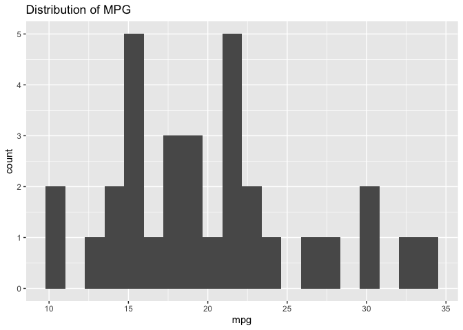
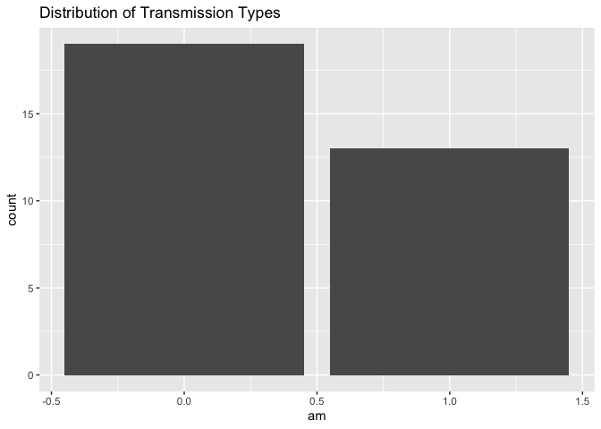
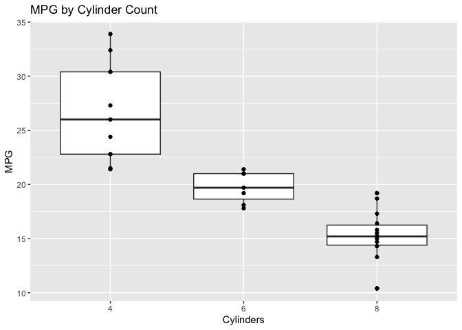
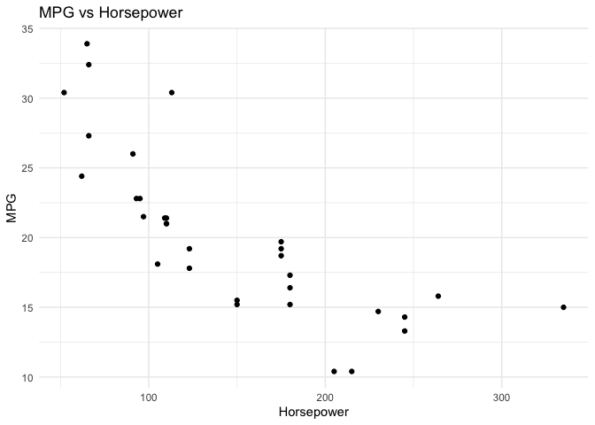

> **Today:** set up folders, load packages, introduction to R variables
> and data structures, data frames and tibbles, key data manipulation
> verbs (`select`, `filter`, `mutate`, and `arrange`), and some basic
> plots.

# 0. Setup

The first chunk below is the code from Brightspace to install the
required packages. BEFORE you run it: please make a folder the “Files”
tab in the bottom right of RStudio is a folder where you will work out
of for the assignment. In class we made one called `ds_iai` and opened a
new R Markdown file inside it.

``` r
# wd = working directory 
# directory is a fancy word for folder
getwd() # where are we working from?
```

    ## [1] "/Users/sxmorgan/Desktop/ds_iai/rmd-code-notebooks"

``` r
# 2.1 install the groundhog package and other packages needed for the course
# install.packages('groundhog', version = '3.2.3')
# install.packages('tidyverse', version = '2.0.0')
# install.packages('here', version = '1.0.2')

# 2.2. attach the groundhog package, to activate taking a "snapshot" of versions
library(groundhog)
```

    ## groundhog says: No default repository found, setting to 'http://cran.r-project.org/'

    ## Attached: 'Groundhog' (Version: 3.2.3)

    ## Tips and troubleshooting: https://groundhogR.com

``` r
# 2.3 pick october 1st as a common reference date and install the packages
groundhog.library(c('here','tidyverse'), "2025-10-01")
```

    ## here() starts at /Users/sxmorgan/Desktop/ds_iai

    ## ── Attaching core tidyverse packages ──────────────────────── tidyverse 2.0.0 ──
    ## ✔ dplyr     1.1.4     ✔ readr     2.1.5
    ## ✔ forcats   1.0.1     ✔ stringr   1.5.2
    ## ✔ ggplot2   4.0.0     ✔ tibble    3.3.0
    ## ✔ lubridate 1.9.4     ✔ tidyr     1.3.1
    ## ✔ purrr     1.1.0     
    ## ── Conflicts ────────────────────────────────────────── tidyverse_conflicts() ──
    ## ✖ dplyr::filter() masks stats::filter()
    ## ✖ dplyr::lag()    masks stats::lag()
    ## ℹ Use the conflicted package (<http://conflicted.r-lib.org/>) to force all conflicts to become errors
    ## Successfully attached 'here_1.0.2'
    ## 
    ## Successfully attached 'tidyverse_2.0.0'

Some of you had issues with the `groundhog` package. If that’s you:
please forget about the `groundhog` package. This package only serves to
help keep the other packages (software libraries) using a correct and
consistent version.

As long as you have the `tidyverse` and `here` packages installed (and
your versions aren’t really old) – you should be fine.

``` r
# if that still doesn't work: just make sure you have the tidyverse and here packages installed
# install.packages('tidyverse', version = '2.0.0')
# install.packages('here', version = '1.0.2')

# and in the very worst case, try without the version argument, and then use sessionInfo() to check what version you use
# library(tidyverse)
# library(here)
# sessionInfo()
```

# 1. Variables and vectors

There are several “types” of variables in R, - chr: characters or
“strings” - num: numeric, can be either integers (1, 2, 3) or double (1,
1.21), sometimes called a “continuous” variable - fct: factor, a
categorical variable which can be chr or num type! sometimes called a
“discrete” variable

We’ll explore these more when we look at real clinical patient data in
the next days.

``` r
x <- "hello" # single string, saved as x
y <- c("my", "first", "vector") # vector of strings, saved as y
z <- c(1, 2, 8, 4) # vector of integers (num), saved as z

# how are factors different than numeric vectors
w <- as_factor(z)
# alternatively:
# w <- factor(z, levels = sort(z))
# bonus: how is the line (function) below different from those above, and why would we (generally) prefer those above?
# w <- as.factor(z)

# how to learn about your variables
typeof(x)
```

    ## [1] "character"

``` r
class(x)
```

    ## [1] "character"

``` r
typeof(z)
```

    ## [1] "double"

``` r
length(y)
```

    ## [1] 3

``` r
levels(w)
```

    ## [1] "1" "2" "4" "8"

``` r
# how to find help
?mean
help.search("median")
```

PS: in general, it’s better to give variables informative names! (Not x
and y)

# 2. Operators and functions

Operators and functions are two critical concepts to “do” things in R.
Operators are symbols that perform specific actions, while functions are
named commands that take inputs (called “arguments”) in parentheses, and
do more complex tasks.

We started the coding demo on day 1 with a function – `getwd()`,
followed by `here()`, which does virtually the same thing. The five
lines under “\# how to learn about your variables” in the code chunk
above are also functions.

We also discussed a few operators, which you’ll be comfortable with by
the end of the assignment:

- the assignment operator is a backwards arrow used to assign things
  (`variable_name <- variable_value`)
- the pipe operator is used to chain or combine multiple functions can
  either be %\>% or \|\>
- the plus operator is used after a `ggplot()` function has been invoked
  to add plot options (layers, as we’ll call them later)

``` r
# basic functions for numeric vectors
z_mean <- mean(z)
z_med <- median(z)

# print
z_mean
```

    ## [1] 3.75

``` r
z_med
```

    ## [1] 3

``` r
# these both give warnings, why?
mean(y) 
```

    ## Warning in mean.default(y): argument is not numeric or logical: returning NA

    ## [1] NA

``` r
mean(w) 
```

    ## Warning in mean.default(w): argument is not numeric or logical: returning NA

    ## [1] NA

``` r
# putting it all together
weights <- c(23.5, 24.1, 23.8, 24.3)  # <- is the assignment operator
average_weight <- mean(weights)       # mean() is a function
difference <- 24.5 - average_weight   # - is the subtraction operator
```

Tip: one final operator that is less common (not part of this
assignment) but useful to know in R is the :: operator. It is used to
invoke a function from a specific package. For example, instead of
loading the `here` package (`library(here)`) and then calling the
`here()` function, you could just type `here::here()` and R will pull
the right function.

# 3. Data frames and tibbles

Data frames are the most common data structure you’ll encounter doing
real data analysis in R – think of it as the R version of an Excel
table. It is similar to a matrix in that it also has row and column
attributes, but

There are several built-in datasets in R: `mtcars` (cars) and `iris`
(flowers) are two of the most popular. In class and in the example we
worked with `mtcars` – complete the chunks below with `iris` for a bit
more of a challenge.

``` r
# We'll start with a built-in dataset (a data.frame)
df <- mtcars
# df <- iris

# prints the first 6 rows of any data frame object
head(df)
```

    ##                    mpg cyl disp  hp drat    wt  qsec vs am gear carb
    ## Mazda RX4         21.0   6  160 110 3.90 2.620 16.46  0  1    4    4
    ## Mazda RX4 Wag     21.0   6  160 110 3.90 2.875 17.02  0  1    4    4
    ## Datsun 710        22.8   4  108  93 3.85 2.320 18.61  1  1    4    1
    ## Hornet 4 Drive    21.4   6  258 110 3.08 3.215 19.44  1  0    3    1
    ## Hornet Sportabout 18.7   8  360 175 3.15 3.440 17.02  0  0    3    2
    ## Valiant           18.1   6  225 105 2.76 3.460 20.22  1  0    3    1

``` r
# accession with [row, column] indices, starting at 1, not 0
df[1,1]
```

    ## [1] 21

``` r
# other things to look at 
dim(df)
```

    ## [1] 32 11

``` r
rownames(df)
```

    ##  [1] "Mazda RX4"           "Mazda RX4 Wag"       "Datsun 710"         
    ##  [4] "Hornet 4 Drive"      "Hornet Sportabout"   "Valiant"            
    ##  [7] "Duster 360"          "Merc 240D"           "Merc 230"           
    ## [10] "Merc 280"            "Merc 280C"           "Merc 450SE"         
    ## [13] "Merc 450SL"          "Merc 450SLC"         "Cadillac Fleetwood" 
    ## [16] "Lincoln Continental" "Chrysler Imperial"   "Fiat 128"           
    ## [19] "Honda Civic"         "Toyota Corolla"      "Toyota Corona"      
    ## [22] "Dodge Challenger"    "AMC Javelin"         "Camaro Z28"         
    ## [25] "Pontiac Firebird"    "Fiat X1-9"           "Porsche 914-2"      
    ## [28] "Lotus Europa"        "Ford Pantera L"      "Ferrari Dino"       
    ## [31] "Maserati Bora"       "Volvo 142E"

``` r
# glimpse is a useful function, especially for data frames which do not give an overview of variable types
glimpse(df)
```

    ## Rows: 32
    ## Columns: 11
    ## $ mpg  <dbl> 21.0, 21.0, 22.8, 21.4, 18.7, 18.1, 14.3, 24.4, 22.8, 19.2, 17.8,…
    ## $ cyl  <dbl> 6, 6, 4, 6, 8, 6, 8, 4, 4, 6, 6, 8, 8, 8, 8, 8, 8, 4, 4, 4, 4, 8,…
    ## $ disp <dbl> 160.0, 160.0, 108.0, 258.0, 360.0, 225.0, 360.0, 146.7, 140.8, 16…
    ## $ hp   <dbl> 110, 110, 93, 110, 175, 105, 245, 62, 95, 123, 123, 180, 180, 180…
    ## $ drat <dbl> 3.90, 3.90, 3.85, 3.08, 3.15, 2.76, 3.21, 3.69, 3.92, 3.92, 3.92,…
    ## $ wt   <dbl> 2.620, 2.875, 2.320, 3.215, 3.440, 3.460, 3.570, 3.190, 3.150, 3.…
    ## $ qsec <dbl> 16.46, 17.02, 18.61, 19.44, 17.02, 20.22, 15.84, 20.00, 22.90, 18…
    ## $ vs   <dbl> 0, 0, 1, 1, 0, 1, 0, 1, 1, 1, 1, 0, 0, 0, 0, 0, 0, 1, 1, 1, 1, 0,…
    ## $ am   <dbl> 1, 1, 1, 0, 0, 0, 0, 0, 0, 0, 0, 0, 0, 0, 0, 0, 0, 1, 1, 1, 0, 0,…
    ## $ gear <dbl> 4, 4, 4, 3, 3, 3, 3, 4, 4, 4, 4, 3, 3, 3, 3, 3, 3, 4, 4, 4, 3, 3,…
    ## $ carb <dbl> 4, 4, 1, 1, 2, 1, 4, 2, 2, 4, 4, 3, 3, 3, 4, 4, 4, 1, 2, 1, 1, 2,…

The tidyverse has its own “class” or type of data frame (named after the
package it comes from) that we discussed: a `tibble`. This is
functionally equivalent to a data frame, but it makes viewing a little
more pleasant (especially in the console), which will become important
once we get into “bigger” data in the coming days.

Data frames have rownames and tibbles don’t! So we have to use a special
command, `rownames_to_column()` when saving one of the built-in datasets
as a variable.

``` r
# why not this?
# cars <- as_tibble(df)

# correct way
cars <- df |> 
  rownames_to_column(var = "car_model") |>
  as_tibble()

cars
```

    ## # A tibble: 32 × 12
    ##    car_model     mpg   cyl  disp    hp  drat    wt  qsec    vs    am  gear  carb
    ##    <chr>       <dbl> <dbl> <dbl> <dbl> <dbl> <dbl> <dbl> <dbl> <dbl> <dbl> <dbl>
    ##  1 Mazda RX4    21       6  160    110  3.9   2.62  16.5     0     1     4     4
    ##  2 Mazda RX4 …  21       6  160    110  3.9   2.88  17.0     0     1     4     4
    ##  3 Datsun 710   22.8     4  108     93  3.85  2.32  18.6     1     1     4     1
    ##  4 Hornet 4 D…  21.4     6  258    110  3.08  3.22  19.4     1     0     3     1
    ##  5 Hornet Spo…  18.7     8  360    175  3.15  3.44  17.0     0     0     3     2
    ##  6 Valiant      18.1     6  225    105  2.76  3.46  20.2     1     0     3     1
    ##  7 Duster 360   14.3     8  360    245  3.21  3.57  15.8     0     0     3     4
    ##  8 Merc 240D    24.4     4  147.    62  3.69  3.19  20       1     0     4     2
    ##  9 Merc 230     22.8     4  141.    95  3.92  3.15  22.9     1     0     4     2
    ## 10 Merc 280     19.2     6  168.   123  3.92  3.44  18.3     1     0     4     4
    ## # ℹ 22 more rows

## Core verbs

Now think back to an Excel table – what are some things you do with one
of those when you’re looking for something? Think of some verbs, imagine
typing those instructions out to someone… The `tidyverse` functions for
manipulating data in R are designed to be intuitive.

The core four:

- `select()` selects whichever columns you tell it, either by name or
  index (number)
- `filter()` filters based on whatever criteria you give it (based on
  the columns you actually have or make)
- `mutate()` changes existing columns or creates new ones (think of
  calculations and transformations, etc)
- `arrange()` arranges or sorts the visual output based on whichever
  column(s) you give it

Often, we will use these in combination with one another, and/or one
after another, which is why the pipe operator (\|\> or %\>%) becomes so
handy.

Fun fact: the pipe operator is possible because the functions we will
learn in the `tidyverse` are standardized to take data frames as the
first argument (input variable). (Confirm this and answer some questions
for your future self by typing `?select` !)

``` r
# select/filter/mutate examples - play around with these!
df_small <- cars |>
  select(car_model, mpg, cyl, hp) |>
  filter(cyl %in% c(4, 6)) |>
  # right now, cyl is a number so we can also do:
  # filter(cyl <= 6) |> 
  mutate(hp_per_cyl = hp / cyl) |>
  arrange(desc(hp))

df_small |> select(car_model, hp_per_cyl, everything())
```

    ## # A tibble: 18 × 5
    ##    car_model      hp_per_cyl   mpg   cyl    hp
    ##    <chr>               <dbl> <dbl> <dbl> <dbl>
    ##  1 Ferrari Dino         29.2  19.7     6   175
    ##  2 Merc 280             20.5  19.2     6   123
    ##  3 Merc 280C            20.5  17.8     6   123
    ##  4 Lotus Europa         28.2  30.4     4   113
    ##  5 Mazda RX4            18.3  21       6   110
    ##  6 Mazda RX4 Wag        18.3  21       6   110
    ##  7 Hornet 4 Drive       18.3  21.4     6   110
    ##  8 Volvo 142E           27.2  21.4     4   109
    ##  9 Valiant              17.5  18.1     6   105
    ## 10 Toyota Corona        24.2  21.5     4    97
    ## 11 Merc 230             23.8  22.8     4    95
    ## 12 Datsun 710           23.2  22.8     4    93
    ## 13 Porsche 914-2        22.8  26       4    91
    ## 14 Fiat 128             16.5  32.4     4    66
    ## 15 Fiat X1-9            16.5  27.3     4    66
    ## 16 Toyota Corolla       16.2  33.9     4    65
    ## 17 Merc 240D            15.5  24.4     4    62
    ## 18 Honda Civic          13    30.4     4    52

# 4. The most important types of plots

Data visualization only got a very brief intro on Day 1. It will get its
own formal introduction on and be the focus of Day 2, so this section
and the next are more preparatory than anything.

First, let’s create a folder (named results or whatever you’d like to
call it) inside of the folder we are working in for the assignment,
using the `here()` function to build up a filepath string.

``` r
# here takes the strings that you give it and pastes them together to make a proper filename for your computer
results_path <- here('results') # one folder
results_path <- here('results','day-1') # subfolder, may need to add recursive=TRUE to dir.create

# bonus: try timestamping your folders
# today() is a function from the lubridate package (not part of core tidyverse) which we can still run thi
# results_path <- here('results', lubridate::today())

# whatever you decide to call it, check that results_path is a real filepath on your computer then create it
dir.create(results_path)
```

How to plot our data? First, need to ask what you would like to show
(more on this to come)…

1.  Relationship? =\> scatter plot with `geom_point()`
2.  Distribution? =\> histogram with `geom_histogram()` or
    `geom_density()`
3.  Comparison? =\> boxplot with `geom_boxplot()`
4.  Composition? =\> stacked bar with `geom_bar()`

Check out the cheatsheet for more options and details:
<https://posit.co/wp-content/uploads/2022/10/data-visualization-1.pdf>

In the following chunk, play around with colors and shapes (use the help
to figure out how if needed!)

``` r
# to visualize distribution of numeric variables: geom_histogram
df |>
  ggplot(aes(x = mpg)) +
  geom_histogram(bins = 20) +
  labs(title = "Distribution of MPG")
```

<!-- -->

``` r
# to visualize distribution of categorical variables: geom_bar (not stacked)
df |>
  # mutate(am = as_factor(am)) |>
  ggplot(aes(x = am)) +
  geom_bar() +
  labs(title = "Distribution of Transmission Types")
```

<!-- -->

``` r
# Boxplot of mpg by cylinders (+ jittered points)
df |>
  ggplot(aes(x = factor(cyl), y = mpg)) +
  geom_boxplot() +
  geom_point() +
  # geom_jitter(width = 0.2, alpha = 0.6) + 
  labs(x = "Cylinders", y = "MPG", title = "MPG by Cylinder Count")
```

<!-- -->

``` r
# Scatter (no smoothing)
# in class we colored by cyl, which we made a factor -- try that on your own here
df |>
  ggplot(aes(x = hp, y = mpg)) +
  geom_point() + #scatter plots are ALWAYS geom_point() not geom_jitter()
  labs(x = "Horsepower", y = "MPG", title = "MPG vs Horsepower") +
  theme_minimal()
```

<!-- -->

# 5. Save a figure (practice using a project path)

If you’ve completed section 4 above and created a results folder and
some plots, it’s time to save them.

First, saving in our R environments by assigning them to a variable
(none of the plots above are).

Then, using a function called `ggsave()` which takes arguments such as
the plot variable name, a filename variable, width, and height (and more
– check `?ggsave`)

``` r
p <- ggplot(df, aes(hp, mpg)) + geom_point()

name_to_save <- here(results_path, "d1_scatter.png")

ggsave(filename = name_to_save, plot = p, width = 5, height = 5)
```

# Exercises: Penguins (Data Frames & Visualizations)

Use the same verbs and plotting steps from today: `select()`,
`filter()`, `mutate()`, `arrange()`, and `ggplot()` + `geom_xxx()` +
`labs()`.

It’s OK if plots print messages about removed rows — the dataset has
some missing values.

## 1) Quick scan (structure & missingness)

How many rows/columns are in `penguins`? Which variables are numeric
vs. categorical? Which columns visibly include missing (NA) values?

``` r
penguins
```

    ##       species    island bill_len bill_dep flipper_len body_mass    sex year
    ## 1      Adelie Torgersen     39.1     18.7         181      3750   male 2007
    ## 2      Adelie Torgersen     39.5     17.4         186      3800 female 2007
    ## 3      Adelie Torgersen     40.3     18.0         195      3250 female 2007
    ## 4      Adelie Torgersen       NA       NA          NA        NA   <NA> 2007
    ## 5      Adelie Torgersen     36.7     19.3         193      3450 female 2007
    ## 6      Adelie Torgersen     39.3     20.6         190      3650   male 2007
    ## 7      Adelie Torgersen     38.9     17.8         181      3625 female 2007
    ## 8      Adelie Torgersen     39.2     19.6         195      4675   male 2007
    ## 9      Adelie Torgersen     34.1     18.1         193      3475   <NA> 2007
    ## 10     Adelie Torgersen     42.0     20.2         190      4250   <NA> 2007
    ## 11     Adelie Torgersen     37.8     17.1         186      3300   <NA> 2007
    ## 12     Adelie Torgersen     37.8     17.3         180      3700   <NA> 2007
    ## 13     Adelie Torgersen     41.1     17.6         182      3200 female 2007
    ## 14     Adelie Torgersen     38.6     21.2         191      3800   male 2007
    ## 15     Adelie Torgersen     34.6     21.1         198      4400   male 2007
    ## 16     Adelie Torgersen     36.6     17.8         185      3700 female 2007
    ## 17     Adelie Torgersen     38.7     19.0         195      3450 female 2007
    ## 18     Adelie Torgersen     42.5     20.7         197      4500   male 2007
    ## 19     Adelie Torgersen     34.4     18.4         184      3325 female 2007
    ## 20     Adelie Torgersen     46.0     21.5         194      4200   male 2007
    ## 21     Adelie    Biscoe     37.8     18.3         174      3400 female 2007
    ## 22     Adelie    Biscoe     37.7     18.7         180      3600   male 2007
    ## 23     Adelie    Biscoe     35.9     19.2         189      3800 female 2007
    ## 24     Adelie    Biscoe     38.2     18.1         185      3950   male 2007
    ## 25     Adelie    Biscoe     38.8     17.2         180      3800   male 2007
    ## 26     Adelie    Biscoe     35.3     18.9         187      3800 female 2007
    ## 27     Adelie    Biscoe     40.6     18.6         183      3550   male 2007
    ## 28     Adelie    Biscoe     40.5     17.9         187      3200 female 2007
    ## 29     Adelie    Biscoe     37.9     18.6         172      3150 female 2007
    ## 30     Adelie    Biscoe     40.5     18.9         180      3950   male 2007
    ## 31     Adelie     Dream     39.5     16.7         178      3250 female 2007
    ## 32     Adelie     Dream     37.2     18.1         178      3900   male 2007
    ## 33     Adelie     Dream     39.5     17.8         188      3300 female 2007
    ## 34     Adelie     Dream     40.9     18.9         184      3900   male 2007
    ## 35     Adelie     Dream     36.4     17.0         195      3325 female 2007
    ## 36     Adelie     Dream     39.2     21.1         196      4150   male 2007
    ## 37     Adelie     Dream     38.8     20.0         190      3950   male 2007
    ## 38     Adelie     Dream     42.2     18.5         180      3550 female 2007
    ## 39     Adelie     Dream     37.6     19.3         181      3300 female 2007
    ## 40     Adelie     Dream     39.8     19.1         184      4650   male 2007
    ## 41     Adelie     Dream     36.5     18.0         182      3150 female 2007
    ## 42     Adelie     Dream     40.8     18.4         195      3900   male 2007
    ## 43     Adelie     Dream     36.0     18.5         186      3100 female 2007
    ## 44     Adelie     Dream     44.1     19.7         196      4400   male 2007
    ## 45     Adelie     Dream     37.0     16.9         185      3000 female 2007
    ## 46     Adelie     Dream     39.6     18.8         190      4600   male 2007
    ## 47     Adelie     Dream     41.1     19.0         182      3425   male 2007
    ## 48     Adelie     Dream     37.5     18.9         179      2975   <NA> 2007
    ## 49     Adelie     Dream     36.0     17.9         190      3450 female 2007
    ## 50     Adelie     Dream     42.3     21.2         191      4150   male 2007
    ## 51     Adelie    Biscoe     39.6     17.7         186      3500 female 2008
    ## 52     Adelie    Biscoe     40.1     18.9         188      4300   male 2008
    ## 53     Adelie    Biscoe     35.0     17.9         190      3450 female 2008
    ## 54     Adelie    Biscoe     42.0     19.5         200      4050   male 2008
    ## 55     Adelie    Biscoe     34.5     18.1         187      2900 female 2008
    ## 56     Adelie    Biscoe     41.4     18.6         191      3700   male 2008
    ## 57     Adelie    Biscoe     39.0     17.5         186      3550 female 2008
    ## 58     Adelie    Biscoe     40.6     18.8         193      3800   male 2008
    ## 59     Adelie    Biscoe     36.5     16.6         181      2850 female 2008
    ## 60     Adelie    Biscoe     37.6     19.1         194      3750   male 2008
    ## 61     Adelie    Biscoe     35.7     16.9         185      3150 female 2008
    ## 62     Adelie    Biscoe     41.3     21.1         195      4400   male 2008
    ## 63     Adelie    Biscoe     37.6     17.0         185      3600 female 2008
    ## 64     Adelie    Biscoe     41.1     18.2         192      4050   male 2008
    ## 65     Adelie    Biscoe     36.4     17.1         184      2850 female 2008
    ## 66     Adelie    Biscoe     41.6     18.0         192      3950   male 2008
    ## 67     Adelie    Biscoe     35.5     16.2         195      3350 female 2008
    ## 68     Adelie    Biscoe     41.1     19.1         188      4100   male 2008
    ## 69     Adelie Torgersen     35.9     16.6         190      3050 female 2008
    ## 70     Adelie Torgersen     41.8     19.4         198      4450   male 2008
    ## 71     Adelie Torgersen     33.5     19.0         190      3600 female 2008
    ## 72     Adelie Torgersen     39.7     18.4         190      3900   male 2008
    ## 73     Adelie Torgersen     39.6     17.2         196      3550 female 2008
    ## 74     Adelie Torgersen     45.8     18.9         197      4150   male 2008
    ## 75     Adelie Torgersen     35.5     17.5         190      3700 female 2008
    ## 76     Adelie Torgersen     42.8     18.5         195      4250   male 2008
    ## 77     Adelie Torgersen     40.9     16.8         191      3700 female 2008
    ## 78     Adelie Torgersen     37.2     19.4         184      3900   male 2008
    ## 79     Adelie Torgersen     36.2     16.1         187      3550 female 2008
    ## 80     Adelie Torgersen     42.1     19.1         195      4000   male 2008
    ## 81     Adelie Torgersen     34.6     17.2         189      3200 female 2008
    ## 82     Adelie Torgersen     42.9     17.6         196      4700   male 2008
    ## 83     Adelie Torgersen     36.7     18.8         187      3800 female 2008
    ## 84     Adelie Torgersen     35.1     19.4         193      4200   male 2008
    ## 85     Adelie     Dream     37.3     17.8         191      3350 female 2008
    ## 86     Adelie     Dream     41.3     20.3         194      3550   male 2008
    ## 87     Adelie     Dream     36.3     19.5         190      3800   male 2008
    ## 88     Adelie     Dream     36.9     18.6         189      3500 female 2008
    ## 89     Adelie     Dream     38.3     19.2         189      3950   male 2008
    ## 90     Adelie     Dream     38.9     18.8         190      3600 female 2008
    ## 91     Adelie     Dream     35.7     18.0         202      3550 female 2008
    ## 92     Adelie     Dream     41.1     18.1         205      4300   male 2008
    ## 93     Adelie     Dream     34.0     17.1         185      3400 female 2008
    ## 94     Adelie     Dream     39.6     18.1         186      4450   male 2008
    ## 95     Adelie     Dream     36.2     17.3         187      3300 female 2008
    ## 96     Adelie     Dream     40.8     18.9         208      4300   male 2008
    ## 97     Adelie     Dream     38.1     18.6         190      3700 female 2008
    ## 98     Adelie     Dream     40.3     18.5         196      4350   male 2008
    ## 99     Adelie     Dream     33.1     16.1         178      2900 female 2008
    ## 100    Adelie     Dream     43.2     18.5         192      4100   male 2008
    ## 101    Adelie    Biscoe     35.0     17.9         192      3725 female 2009
    ## 102    Adelie    Biscoe     41.0     20.0         203      4725   male 2009
    ## 103    Adelie    Biscoe     37.7     16.0         183      3075 female 2009
    ## 104    Adelie    Biscoe     37.8     20.0         190      4250   male 2009
    ## 105    Adelie    Biscoe     37.9     18.6         193      2925 female 2009
    ## 106    Adelie    Biscoe     39.7     18.9         184      3550   male 2009
    ## 107    Adelie    Biscoe     38.6     17.2         199      3750 female 2009
    ## 108    Adelie    Biscoe     38.2     20.0         190      3900   male 2009
    ## 109    Adelie    Biscoe     38.1     17.0         181      3175 female 2009
    ## 110    Adelie    Biscoe     43.2     19.0         197      4775   male 2009
    ## 111    Adelie    Biscoe     38.1     16.5         198      3825 female 2009
    ## 112    Adelie    Biscoe     45.6     20.3         191      4600   male 2009
    ## 113    Adelie    Biscoe     39.7     17.7         193      3200 female 2009
    ## 114    Adelie    Biscoe     42.2     19.5         197      4275   male 2009
    ## 115    Adelie    Biscoe     39.6     20.7         191      3900 female 2009
    ## 116    Adelie    Biscoe     42.7     18.3         196      4075   male 2009
    ## 117    Adelie Torgersen     38.6     17.0         188      2900 female 2009
    ## 118    Adelie Torgersen     37.3     20.5         199      3775   male 2009
    ## 119    Adelie Torgersen     35.7     17.0         189      3350 female 2009
    ## 120    Adelie Torgersen     41.1     18.6         189      3325   male 2009
    ## 121    Adelie Torgersen     36.2     17.2         187      3150 female 2009
    ## 122    Adelie Torgersen     37.7     19.8         198      3500   male 2009
    ## 123    Adelie Torgersen     40.2     17.0         176      3450 female 2009
    ## 124    Adelie Torgersen     41.4     18.5         202      3875   male 2009
    ## 125    Adelie Torgersen     35.2     15.9         186      3050 female 2009
    ## 126    Adelie Torgersen     40.6     19.0         199      4000   male 2009
    ## 127    Adelie Torgersen     38.8     17.6         191      3275 female 2009
    ## 128    Adelie Torgersen     41.5     18.3         195      4300   male 2009
    ## 129    Adelie Torgersen     39.0     17.1         191      3050 female 2009
    ## 130    Adelie Torgersen     44.1     18.0         210      4000   male 2009
    ## 131    Adelie Torgersen     38.5     17.9         190      3325 female 2009
    ## 132    Adelie Torgersen     43.1     19.2         197      3500   male 2009
    ## 133    Adelie     Dream     36.8     18.5         193      3500 female 2009
    ## 134    Adelie     Dream     37.5     18.5         199      4475   male 2009
    ## 135    Adelie     Dream     38.1     17.6         187      3425 female 2009
    ## 136    Adelie     Dream     41.1     17.5         190      3900   male 2009
    ## 137    Adelie     Dream     35.6     17.5         191      3175 female 2009
    ## 138    Adelie     Dream     40.2     20.1         200      3975   male 2009
    ## 139    Adelie     Dream     37.0     16.5         185      3400 female 2009
    ## 140    Adelie     Dream     39.7     17.9         193      4250   male 2009
    ## 141    Adelie     Dream     40.2     17.1         193      3400 female 2009
    ## 142    Adelie     Dream     40.6     17.2         187      3475   male 2009
    ## 143    Adelie     Dream     32.1     15.5         188      3050 female 2009
    ## 144    Adelie     Dream     40.7     17.0         190      3725   male 2009
    ## 145    Adelie     Dream     37.3     16.8         192      3000 female 2009
    ## 146    Adelie     Dream     39.0     18.7         185      3650   male 2009
    ## 147    Adelie     Dream     39.2     18.6         190      4250   male 2009
    ## 148    Adelie     Dream     36.6     18.4         184      3475 female 2009
    ## 149    Adelie     Dream     36.0     17.8         195      3450 female 2009
    ## 150    Adelie     Dream     37.8     18.1         193      3750   male 2009
    ## 151    Adelie     Dream     36.0     17.1         187      3700 female 2009
    ## 152    Adelie     Dream     41.5     18.5         201      4000   male 2009
    ## 153    Gentoo    Biscoe     46.1     13.2         211      4500 female 2007
    ## 154    Gentoo    Biscoe     50.0     16.3         230      5700   male 2007
    ## 155    Gentoo    Biscoe     48.7     14.1         210      4450 female 2007
    ## 156    Gentoo    Biscoe     50.0     15.2         218      5700   male 2007
    ## 157    Gentoo    Biscoe     47.6     14.5         215      5400   male 2007
    ## 158    Gentoo    Biscoe     46.5     13.5         210      4550 female 2007
    ## 159    Gentoo    Biscoe     45.4     14.6         211      4800 female 2007
    ## 160    Gentoo    Biscoe     46.7     15.3         219      5200   male 2007
    ## 161    Gentoo    Biscoe     43.3     13.4         209      4400 female 2007
    ## 162    Gentoo    Biscoe     46.8     15.4         215      5150   male 2007
    ## 163    Gentoo    Biscoe     40.9     13.7         214      4650 female 2007
    ## 164    Gentoo    Biscoe     49.0     16.1         216      5550   male 2007
    ## 165    Gentoo    Biscoe     45.5     13.7         214      4650 female 2007
    ## 166    Gentoo    Biscoe     48.4     14.6         213      5850   male 2007
    ## 167    Gentoo    Biscoe     45.8     14.6         210      4200 female 2007
    ## 168    Gentoo    Biscoe     49.3     15.7         217      5850   male 2007
    ## 169    Gentoo    Biscoe     42.0     13.5         210      4150 female 2007
    ## 170    Gentoo    Biscoe     49.2     15.2         221      6300   male 2007
    ## 171    Gentoo    Biscoe     46.2     14.5         209      4800 female 2007
    ## 172    Gentoo    Biscoe     48.7     15.1         222      5350   male 2007
    ## 173    Gentoo    Biscoe     50.2     14.3         218      5700   male 2007
    ## 174    Gentoo    Biscoe     45.1     14.5         215      5000 female 2007
    ## 175    Gentoo    Biscoe     46.5     14.5         213      4400 female 2007
    ## 176    Gentoo    Biscoe     46.3     15.8         215      5050   male 2007
    ## 177    Gentoo    Biscoe     42.9     13.1         215      5000 female 2007
    ## 178    Gentoo    Biscoe     46.1     15.1         215      5100   male 2007
    ## 179    Gentoo    Biscoe     44.5     14.3         216      4100   <NA> 2007
    ## 180    Gentoo    Biscoe     47.8     15.0         215      5650   male 2007
    ## 181    Gentoo    Biscoe     48.2     14.3         210      4600 female 2007
    ## 182    Gentoo    Biscoe     50.0     15.3         220      5550   male 2007
    ## 183    Gentoo    Biscoe     47.3     15.3         222      5250   male 2007
    ## 184    Gentoo    Biscoe     42.8     14.2         209      4700 female 2007
    ## 185    Gentoo    Biscoe     45.1     14.5         207      5050 female 2007
    ## 186    Gentoo    Biscoe     59.6     17.0         230      6050   male 2007
    ## 187    Gentoo    Biscoe     49.1     14.8         220      5150 female 2008
    ## 188    Gentoo    Biscoe     48.4     16.3         220      5400   male 2008
    ## 189    Gentoo    Biscoe     42.6     13.7         213      4950 female 2008
    ## 190    Gentoo    Biscoe     44.4     17.3         219      5250   male 2008
    ## 191    Gentoo    Biscoe     44.0     13.6         208      4350 female 2008
    ## 192    Gentoo    Biscoe     48.7     15.7         208      5350   male 2008
    ## 193    Gentoo    Biscoe     42.7     13.7         208      3950 female 2008
    ## 194    Gentoo    Biscoe     49.6     16.0         225      5700   male 2008
    ## 195    Gentoo    Biscoe     45.3     13.7         210      4300 female 2008
    ## 196    Gentoo    Biscoe     49.6     15.0         216      4750   male 2008
    ## 197    Gentoo    Biscoe     50.5     15.9         222      5550   male 2008
    ## 198    Gentoo    Biscoe     43.6     13.9         217      4900 female 2008
    ## 199    Gentoo    Biscoe     45.5     13.9         210      4200 female 2008
    ## 200    Gentoo    Biscoe     50.5     15.9         225      5400   male 2008
    ## 201    Gentoo    Biscoe     44.9     13.3         213      5100 female 2008
    ## 202    Gentoo    Biscoe     45.2     15.8         215      5300   male 2008
    ## 203    Gentoo    Biscoe     46.6     14.2         210      4850 female 2008
    ## 204    Gentoo    Biscoe     48.5     14.1         220      5300   male 2008
    ## 205    Gentoo    Biscoe     45.1     14.4         210      4400 female 2008
    ## 206    Gentoo    Biscoe     50.1     15.0         225      5000   male 2008
    ## 207    Gentoo    Biscoe     46.5     14.4         217      4900 female 2008
    ## 208    Gentoo    Biscoe     45.0     15.4         220      5050   male 2008
    ## 209    Gentoo    Biscoe     43.8     13.9         208      4300 female 2008
    ## 210    Gentoo    Biscoe     45.5     15.0         220      5000   male 2008
    ## 211    Gentoo    Biscoe     43.2     14.5         208      4450 female 2008
    ## 212    Gentoo    Biscoe     50.4     15.3         224      5550   male 2008
    ## 213    Gentoo    Biscoe     45.3     13.8         208      4200 female 2008
    ## 214    Gentoo    Biscoe     46.2     14.9         221      5300   male 2008
    ## 215    Gentoo    Biscoe     45.7     13.9         214      4400 female 2008
    ## 216    Gentoo    Biscoe     54.3     15.7         231      5650   male 2008
    ## 217    Gentoo    Biscoe     45.8     14.2         219      4700 female 2008
    ## 218    Gentoo    Biscoe     49.8     16.8         230      5700   male 2008
    ## 219    Gentoo    Biscoe     46.2     14.4         214      4650   <NA> 2008
    ## 220    Gentoo    Biscoe     49.5     16.2         229      5800   male 2008
    ## 221    Gentoo    Biscoe     43.5     14.2         220      4700 female 2008
    ## 222    Gentoo    Biscoe     50.7     15.0         223      5550   male 2008
    ## 223    Gentoo    Biscoe     47.7     15.0         216      4750 female 2008
    ## 224    Gentoo    Biscoe     46.4     15.6         221      5000   male 2008
    ## 225    Gentoo    Biscoe     48.2     15.6         221      5100   male 2008
    ## 226    Gentoo    Biscoe     46.5     14.8         217      5200 female 2008
    ## 227    Gentoo    Biscoe     46.4     15.0         216      4700 female 2008
    ## 228    Gentoo    Biscoe     48.6     16.0         230      5800   male 2008
    ## 229    Gentoo    Biscoe     47.5     14.2         209      4600 female 2008
    ## 230    Gentoo    Biscoe     51.1     16.3         220      6000   male 2008
    ## 231    Gentoo    Biscoe     45.2     13.8         215      4750 female 2008
    ## 232    Gentoo    Biscoe     45.2     16.4         223      5950   male 2008
    ## 233    Gentoo    Biscoe     49.1     14.5         212      4625 female 2009
    ## 234    Gentoo    Biscoe     52.5     15.6         221      5450   male 2009
    ## 235    Gentoo    Biscoe     47.4     14.6         212      4725 female 2009
    ## 236    Gentoo    Biscoe     50.0     15.9         224      5350   male 2009
    ## 237    Gentoo    Biscoe     44.9     13.8         212      4750 female 2009
    ## 238    Gentoo    Biscoe     50.8     17.3         228      5600   male 2009
    ## 239    Gentoo    Biscoe     43.4     14.4         218      4600 female 2009
    ## 240    Gentoo    Biscoe     51.3     14.2         218      5300   male 2009
    ## 241    Gentoo    Biscoe     47.5     14.0         212      4875 female 2009
    ## 242    Gentoo    Biscoe     52.1     17.0         230      5550   male 2009
    ## 243    Gentoo    Biscoe     47.5     15.0         218      4950 female 2009
    ## 244    Gentoo    Biscoe     52.2     17.1         228      5400   male 2009
    ## 245    Gentoo    Biscoe     45.5     14.5         212      4750 female 2009
    ## 246    Gentoo    Biscoe     49.5     16.1         224      5650   male 2009
    ## 247    Gentoo    Biscoe     44.5     14.7         214      4850 female 2009
    ## 248    Gentoo    Biscoe     50.8     15.7         226      5200   male 2009
    ## 249    Gentoo    Biscoe     49.4     15.8         216      4925   male 2009
    ## 250    Gentoo    Biscoe     46.9     14.6         222      4875 female 2009
    ## 251    Gentoo    Biscoe     48.4     14.4         203      4625 female 2009
    ## 252    Gentoo    Biscoe     51.1     16.5         225      5250   male 2009
    ## 253    Gentoo    Biscoe     48.5     15.0         219      4850 female 2009
    ## 254    Gentoo    Biscoe     55.9     17.0         228      5600   male 2009
    ## 255    Gentoo    Biscoe     47.2     15.5         215      4975 female 2009
    ## 256    Gentoo    Biscoe     49.1     15.0         228      5500   male 2009
    ## 257    Gentoo    Biscoe     47.3     13.8         216      4725   <NA> 2009
    ## 258    Gentoo    Biscoe     46.8     16.1         215      5500   male 2009
    ## 259    Gentoo    Biscoe     41.7     14.7         210      4700 female 2009
    ## 260    Gentoo    Biscoe     53.4     15.8         219      5500   male 2009
    ## 261    Gentoo    Biscoe     43.3     14.0         208      4575 female 2009
    ## 262    Gentoo    Biscoe     48.1     15.1         209      5500   male 2009
    ## 263    Gentoo    Biscoe     50.5     15.2         216      5000 female 2009
    ## 264    Gentoo    Biscoe     49.8     15.9         229      5950   male 2009
    ## 265    Gentoo    Biscoe     43.5     15.2         213      4650 female 2009
    ## 266    Gentoo    Biscoe     51.5     16.3         230      5500   male 2009
    ## 267    Gentoo    Biscoe     46.2     14.1         217      4375 female 2009
    ## 268    Gentoo    Biscoe     55.1     16.0         230      5850   male 2009
    ## 269    Gentoo    Biscoe     44.5     15.7         217      4875   <NA> 2009
    ## 270    Gentoo    Biscoe     48.8     16.2         222      6000   male 2009
    ## 271    Gentoo    Biscoe     47.2     13.7         214      4925 female 2009
    ## 272    Gentoo    Biscoe       NA       NA          NA        NA   <NA> 2009
    ## 273    Gentoo    Biscoe     46.8     14.3         215      4850 female 2009
    ## 274    Gentoo    Biscoe     50.4     15.7         222      5750   male 2009
    ## 275    Gentoo    Biscoe     45.2     14.8         212      5200 female 2009
    ## 276    Gentoo    Biscoe     49.9     16.1         213      5400   male 2009
    ## 277 Chinstrap     Dream     46.5     17.9         192      3500 female 2007
    ## 278 Chinstrap     Dream     50.0     19.5         196      3900   male 2007
    ## 279 Chinstrap     Dream     51.3     19.2         193      3650   male 2007
    ## 280 Chinstrap     Dream     45.4     18.7         188      3525 female 2007
    ## 281 Chinstrap     Dream     52.7     19.8         197      3725   male 2007
    ## 282 Chinstrap     Dream     45.2     17.8         198      3950 female 2007
    ## 283 Chinstrap     Dream     46.1     18.2         178      3250 female 2007
    ## 284 Chinstrap     Dream     51.3     18.2         197      3750   male 2007
    ## 285 Chinstrap     Dream     46.0     18.9         195      4150 female 2007
    ## 286 Chinstrap     Dream     51.3     19.9         198      3700   male 2007
    ## 287 Chinstrap     Dream     46.6     17.8         193      3800 female 2007
    ## 288 Chinstrap     Dream     51.7     20.3         194      3775   male 2007
    ## 289 Chinstrap     Dream     47.0     17.3         185      3700 female 2007
    ## 290 Chinstrap     Dream     52.0     18.1         201      4050   male 2007
    ## 291 Chinstrap     Dream     45.9     17.1         190      3575 female 2007
    ## 292 Chinstrap     Dream     50.5     19.6         201      4050   male 2007
    ## 293 Chinstrap     Dream     50.3     20.0         197      3300   male 2007
    ## 294 Chinstrap     Dream     58.0     17.8         181      3700 female 2007
    ## 295 Chinstrap     Dream     46.4     18.6         190      3450 female 2007
    ## 296 Chinstrap     Dream     49.2     18.2         195      4400   male 2007
    ## 297 Chinstrap     Dream     42.4     17.3         181      3600 female 2007
    ## 298 Chinstrap     Dream     48.5     17.5         191      3400   male 2007
    ## 299 Chinstrap     Dream     43.2     16.6         187      2900 female 2007
    ## 300 Chinstrap     Dream     50.6     19.4         193      3800   male 2007
    ## 301 Chinstrap     Dream     46.7     17.9         195      3300 female 2007
    ## 302 Chinstrap     Dream     52.0     19.0         197      4150   male 2007
    ## 303 Chinstrap     Dream     50.5     18.4         200      3400 female 2008
    ## 304 Chinstrap     Dream     49.5     19.0         200      3800   male 2008
    ## 305 Chinstrap     Dream     46.4     17.8         191      3700 female 2008
    ## 306 Chinstrap     Dream     52.8     20.0         205      4550   male 2008
    ## 307 Chinstrap     Dream     40.9     16.6         187      3200 female 2008
    ## 308 Chinstrap     Dream     54.2     20.8         201      4300   male 2008
    ## 309 Chinstrap     Dream     42.5     16.7         187      3350 female 2008
    ## 310 Chinstrap     Dream     51.0     18.8         203      4100   male 2008
    ## 311 Chinstrap     Dream     49.7     18.6         195      3600   male 2008
    ## 312 Chinstrap     Dream     47.5     16.8         199      3900 female 2008
    ## 313 Chinstrap     Dream     47.6     18.3         195      3850 female 2008
    ## 314 Chinstrap     Dream     52.0     20.7         210      4800   male 2008
    ## 315 Chinstrap     Dream     46.9     16.6         192      2700 female 2008
    ## 316 Chinstrap     Dream     53.5     19.9         205      4500   male 2008
    ## 317 Chinstrap     Dream     49.0     19.5         210      3950   male 2008
    ## 318 Chinstrap     Dream     46.2     17.5         187      3650 female 2008
    ## 319 Chinstrap     Dream     50.9     19.1         196      3550   male 2008
    ## 320 Chinstrap     Dream     45.5     17.0         196      3500 female 2008
    ## 321 Chinstrap     Dream     50.9     17.9         196      3675 female 2009
    ## 322 Chinstrap     Dream     50.8     18.5         201      4450   male 2009
    ## 323 Chinstrap     Dream     50.1     17.9         190      3400 female 2009
    ## 324 Chinstrap     Dream     49.0     19.6         212      4300   male 2009
    ## 325 Chinstrap     Dream     51.5     18.7         187      3250   male 2009
    ## 326 Chinstrap     Dream     49.8     17.3         198      3675 female 2009
    ## 327 Chinstrap     Dream     48.1     16.4         199      3325 female 2009
    ## 328 Chinstrap     Dream     51.4     19.0         201      3950   male 2009
    ## 329 Chinstrap     Dream     45.7     17.3         193      3600 female 2009
    ## 330 Chinstrap     Dream     50.7     19.7         203      4050   male 2009
    ## 331 Chinstrap     Dream     42.5     17.3         187      3350 female 2009
    ## 332 Chinstrap     Dream     52.2     18.8         197      3450   male 2009
    ## 333 Chinstrap     Dream     45.2     16.6         191      3250 female 2009
    ## 334 Chinstrap     Dream     49.3     19.9         203      4050   male 2009
    ## 335 Chinstrap     Dream     50.2     18.8         202      3800   male 2009
    ## 336 Chinstrap     Dream     45.6     19.4         194      3525 female 2009
    ## 337 Chinstrap     Dream     51.9     19.5         206      3950   male 2009
    ## 338 Chinstrap     Dream     46.8     16.5         189      3650 female 2009
    ## 339 Chinstrap     Dream     45.7     17.0         195      3650 female 2009
    ## 340 Chinstrap     Dream     55.8     19.8         207      4000   male 2009
    ## 341 Chinstrap     Dream     43.5     18.1         202      3400 female 2009
    ## 342 Chinstrap     Dream     49.6     18.2         193      3775   male 2009
    ## 343 Chinstrap     Dream     50.8     19.0         210      4100   male 2009
    ## 344 Chinstrap     Dream     50.2     18.7         198      3775 female 2009

``` r
head(penguins)
```

    ##   species    island bill_len bill_dep flipper_len body_mass    sex year
    ## 1  Adelie Torgersen     39.1     18.7         181      3750   male 2007
    ## 2  Adelie Torgersen     39.5     17.4         186      3800 female 2007
    ## 3  Adelie Torgersen     40.3     18.0         195      3250 female 2007
    ## 4  Adelie Torgersen       NA       NA          NA        NA   <NA> 2007
    ## 5  Adelie Torgersen     36.7     19.3         193      3450 female 2007
    ## 6  Adelie Torgersen     39.3     20.6         190      3650   male 2007

## 2) Focus on one species (filter, select, arrange)

Keep only Adelie rows; store as `adelie_tbl`. Keep just: `bill_len`,
`bill_dep`, `flipper_len`, `body_mass`, `year`. Sort descending by
`body_mass`.

Question: about how many Adelie penguins are over 4000 g?

``` r
# YOUR CODE HERE
```

## 3) Derived variable (mutate)

In `adelie_tbl`, create `bill_ratio` = `bill_len` / `bill_dep`. Sort by
`bill_ratio` (largest first).

Question: what does a larger `bill_ratio` suggest?

``` r
# YOUR CODE HERE
```

## 4) Relationship plot (scatter)

Make a scatter plot of bill length vs body mass. Color points by
species. Add a clear title and axis labels with labs(). Save your image
to the results folder we made and use a descriptive name.

``` r
# YOUR CODE HERE
```
