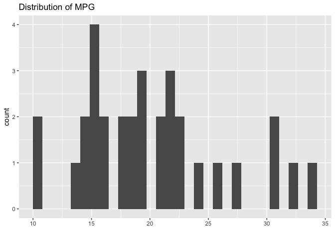

Setup:

``` r
groundhog::groundhog.library(c('tidyverse','here'), "2025-10-01")
```

    ## groundhog says: No default repository found, setting to 'http://cran.r-project.org/'

    ## ── Attaching core tidyverse packages ──────────────────────── tidyverse 2.0.0 ──
    ## ✔ dplyr     1.1.4     ✔ readr     2.1.5
    ## ✔ forcats   1.0.1     ✔ stringr   1.5.2
    ## ✔ ggplot2   4.0.0     ✔ tibble    3.3.0
    ## ✔ lubridate 1.9.4     ✔ tidyr     1.3.1
    ## ✔ purrr     1.1.0     
    ## ── Conflicts ────────────────────────────────────────── tidyverse_conflicts() ──
    ## ✖ dplyr::filter() masks stats::filter()
    ## ✖ dplyr::lag()    masks stats::lag()
    ## ℹ Use the conflicted package (<http://conflicted.r-lib.org/>) to force all conflicts to become errors
    ## here() starts at /Users/sxmorgan/Desktop/ds_iai/rmd-code-notebooks
    ## 
    ## Successfully attached 'tidyverse_2.0.0'
    ## 
    ## Successfully attached 'here_1.0.2'

``` r
# if that doesn't / didn't work, try the two below instead (comment line above out):
# library(tidyverse)
# library(here)

results_path <- here::here("results", "day-1")

dir.create(results_path, recursive = TRUE)
```

Basic variables and data structures:

``` r
# variable assignment
x <- "hello"

# vectors
y <- c("my", "first", "vector")
z <- c(1, 2, 4, 7.2)
w <- c(1, 2, 3)

# basic functions
typeof(z)
```

    ## [1] "double"

``` r
class(z) 
```

    ## [1] "numeric"

``` r
typeof(as.integer(w))
```

    ## [1] "integer"

``` r
length(y)
```

    ## [1] 3

``` r
length(z)
```

    ## [1] 4

``` r
mean_z <- mean(z)
med_z <- median(z)

# data frames and tibbles
df <- data.frame(y = y, w = w)
tbl <- tibble(y = y, w = w)
```

Data frame manipulations and building up to a plot:

``` r
# library(tidyverse)

# mtcars is a built-in dataset about cars
# extra: https://www.robertmylesmcdonnell.com/posts/mtcars
mtcars 
```

    ##                      mpg cyl  disp  hp drat    wt  qsec vs am gear carb
    ## Mazda RX4           21.0   6 160.0 110 3.90 2.620 16.46  0  1    4    4
    ## Mazda RX4 Wag       21.0   6 160.0 110 3.90 2.875 17.02  0  1    4    4
    ## Datsun 710          22.8   4 108.0  93 3.85 2.320 18.61  1  1    4    1
    ## Hornet 4 Drive      21.4   6 258.0 110 3.08 3.215 19.44  1  0    3    1
    ## Hornet Sportabout   18.7   8 360.0 175 3.15 3.440 17.02  0  0    3    2
    ## Valiant             18.1   6 225.0 105 2.76 3.460 20.22  1  0    3    1
    ## Duster 360          14.3   8 360.0 245 3.21 3.570 15.84  0  0    3    4
    ## Merc 240D           24.4   4 146.7  62 3.69 3.190 20.00  1  0    4    2
    ## Merc 230            22.8   4 140.8  95 3.92 3.150 22.90  1  0    4    2
    ## Merc 280            19.2   6 167.6 123 3.92 3.440 18.30  1  0    4    4
    ## Merc 280C           17.8   6 167.6 123 3.92 3.440 18.90  1  0    4    4
    ## Merc 450SE          16.4   8 275.8 180 3.07 4.070 17.40  0  0    3    3
    ## Merc 450SL          17.3   8 275.8 180 3.07 3.730 17.60  0  0    3    3
    ## Merc 450SLC         15.2   8 275.8 180 3.07 3.780 18.00  0  0    3    3
    ## Cadillac Fleetwood  10.4   8 472.0 205 2.93 5.250 17.98  0  0    3    4
    ## Lincoln Continental 10.4   8 460.0 215 3.00 5.424 17.82  0  0    3    4
    ## Chrysler Imperial   14.7   8 440.0 230 3.23 5.345 17.42  0  0    3    4
    ## Fiat 128            32.4   4  78.7  66 4.08 2.200 19.47  1  1    4    1
    ## Honda Civic         30.4   4  75.7  52 4.93 1.615 18.52  1  1    4    2
    ## Toyota Corolla      33.9   4  71.1  65 4.22 1.835 19.90  1  1    4    1
    ## Toyota Corona       21.5   4 120.1  97 3.70 2.465 20.01  1  0    3    1
    ## Dodge Challenger    15.5   8 318.0 150 2.76 3.520 16.87  0  0    3    2
    ## AMC Javelin         15.2   8 304.0 150 3.15 3.435 17.30  0  0    3    2
    ## Camaro Z28          13.3   8 350.0 245 3.73 3.840 15.41  0  0    3    4
    ## Pontiac Firebird    19.2   8 400.0 175 3.08 3.845 17.05  0  0    3    2
    ## Fiat X1-9           27.3   4  79.0  66 4.08 1.935 18.90  1  1    4    1
    ## Porsche 914-2       26.0   4 120.3  91 4.43 2.140 16.70  0  1    5    2
    ## Lotus Europa        30.4   4  95.1 113 3.77 1.513 16.90  1  1    5    2
    ## Ford Pantera L      15.8   8 351.0 264 4.22 3.170 14.50  0  1    5    4
    ## Ferrari Dino        19.7   6 145.0 175 3.62 2.770 15.50  0  1    5    6
    ## Maserati Bora       15.0   8 301.0 335 3.54 3.570 14.60  0  1    5    8
    ## Volvo 142E          21.4   4 121.0 109 4.11 2.780 18.60  1  1    4    2

``` r
class(mtcars) 
```

    ## [1] "data.frame"

``` r
dim(mtcars)
```

    ## [1] 32 11

``` r
glimpse(mtcars)
```

    ## Rows: 32
    ## Columns: 11
    ## $ mpg  <dbl> 21.0, 21.0, 22.8, 21.4, 18.7, 18.1, 14.3, 24.4, 22.8, 19.2, 17.8,…
    ## $ cyl  <dbl> 6, 6, 4, 6, 8, 6, 8, 4, 4, 6, 6, 8, 8, 8, 8, 8, 8, 4, 4, 4, 4, 8,…
    ## $ disp <dbl> 160.0, 160.0, 108.0, 258.0, 360.0, 225.0, 360.0, 146.7, 140.8, 16…
    ## $ hp   <dbl> 110, 110, 93, 110, 175, 105, 245, 62, 95, 123, 123, 180, 180, 180…
    ## $ drat <dbl> 3.90, 3.90, 3.85, 3.08, 3.15, 2.76, 3.21, 3.69, 3.92, 3.92, 3.92,…
    ## $ wt   <dbl> 2.620, 2.875, 2.320, 3.215, 3.440, 3.460, 3.570, 3.190, 3.150, 3.…
    ## $ qsec <dbl> 16.46, 17.02, 18.61, 19.44, 17.02, 20.22, 15.84, 20.00, 22.90, 18…
    ## $ vs   <dbl> 0, 0, 1, 1, 0, 1, 0, 1, 1, 1, 1, 0, 0, 0, 0, 0, 0, 1, 1, 1, 1, 0,…
    ## $ am   <dbl> 1, 1, 1, 0, 0, 0, 0, 0, 0, 0, 0, 0, 0, 0, 0, 0, 0, 1, 1, 1, 0, 0,…
    ## $ gear <dbl> 4, 4, 4, 3, 3, 3, 3, 4, 4, 4, 4, 3, 3, 3, 3, 3, 3, 4, 4, 4, 3, 3,…
    ## $ carb <dbl> 4, 4, 1, 1, 2, 1, 4, 2, 2, 4, 4, 3, 3, 3, 4, 4, 4, 1, 2, 1, 1, 2,…

``` r
rownames(mtcars)
```

    ##  [1] "Mazda RX4"           "Mazda RX4 Wag"       "Datsun 710"         
    ##  [4] "Hornet 4 Drive"      "Hornet Sportabout"   "Valiant"            
    ##  [7] "Duster 360"          "Merc 240D"           "Merc 230"           
    ## [10] "Merc 280"            "Merc 280C"           "Merc 450SE"         
    ## [13] "Merc 450SL"          "Merc 450SLC"         "Cadillac Fleetwood" 
    ## [16] "Lincoln Continental" "Chrysler Imperial"   "Fiat 128"           
    ## [19] "Honda Civic"         "Toyota Corolla"      "Toyota Corona"      
    ## [22] "Dodge Challenger"    "AMC Javelin"         "Camaro Z28"         
    ## [25] "Pontiac Firebird"    "Fiat X1-9"           "Porsche 914-2"      
    ## [28] "Lotus Europa"        "Ford Pantera L"      "Ferrari Dino"       
    ## [31] "Maserati Bora"       "Volvo 142E"

``` r
# make it a tibble
mt_tbl <- mtcars |>
  rownames_to_column(var = "car_model") |>
  as_tibble()

# why not this?
as_tibble(mtcars)
```

    ## # A tibble: 32 × 11
    ##      mpg   cyl  disp    hp  drat    wt  qsec    vs    am  gear  carb
    ##    <dbl> <dbl> <dbl> <dbl> <dbl> <dbl> <dbl> <dbl> <dbl> <dbl> <dbl>
    ##  1  21       6  160    110  3.9   2.62  16.5     0     1     4     4
    ##  2  21       6  160    110  3.9   2.88  17.0     0     1     4     4
    ##  3  22.8     4  108     93  3.85  2.32  18.6     1     1     4     1
    ##  4  21.4     6  258    110  3.08  3.22  19.4     1     0     3     1
    ##  5  18.7     8  360    175  3.15  3.44  17.0     0     0     3     2
    ##  6  18.1     6  225    105  2.76  3.46  20.2     1     0     3     1
    ##  7  14.3     8  360    245  3.21  3.57  15.8     0     0     3     4
    ##  8  24.4     4  147.    62  3.69  3.19  20       1     0     4     2
    ##  9  22.8     4  141.    95  3.92  3.15  22.9     1     0     4     2
    ## 10  19.2     6  168.   123  3.92  3.44  18.3     1     0     4     4
    ## # ℹ 22 more rows

``` r
# core verbs
df_small <- mt_tbl |>
  select(car_model, mpg, cyl, hp) |>
  filter(cyl %in% c(4, 6)) |>
  mutate(hp_per_cyl = hp / cyl) |>
  arrange(desc(mpg))

# histogram - single variable plot 
mt_tbl |>
  ggplot(aes(x = mpg)) +
  geom_histogram(bins = 30) +
  labs(title = "Distribution of MPG", x="")
```

<!-- -->

``` r
# scatter plot
my_plot <- mt_tbl |>
  mutate(cyl = as.factor(cyl)) |>
  ggplot(aes(x = hp, y = mpg)) +
  geom_point(aes(color = cyl))

# saving
ggsave(filename = here(results_path, "d1_scatter_example.png"),
       plot = my_plot, 
       width = 5, height = 4, dpi = 300)
```
