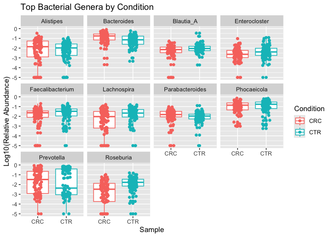
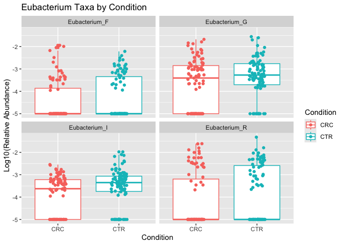
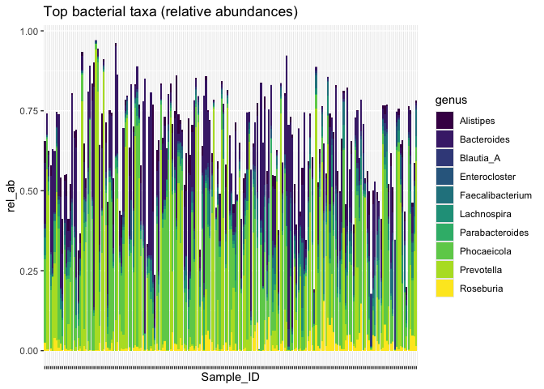
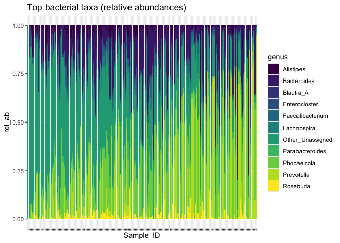

# 0. Setup

``` r
groundhog::groundhog.library(c("tidyverse","here"), "2025-10-01")
```

    ## groundhog says: No default repository found, setting to 'http://cran.r-project.org/'

    ## ── Attaching core tidyverse packages ──────────────────────── tidyverse 2.0.0 ──
    ## ✔ dplyr     1.1.4     ✔ readr     2.1.5
    ## ✔ forcats   1.0.1     ✔ stringr   1.5.2
    ## ✔ ggplot2   4.0.0     ✔ tibble    3.3.0
    ## ✔ lubridate 1.9.4     ✔ tidyr     1.3.1
    ## ✔ purrr     1.1.0     
    ## ── Conflicts ────────────────────────────────────────── tidyverse_conflicts() ──
    ## ✖ dplyr::filter() masks stats::filter()
    ## ✖ dplyr::lag()    masks stats::lag()
    ## ℹ Use the conflicted package (<http://conflicted.r-lib.org/>) to force all conflicts to become errors
    ## here() starts at /Users/sxmorgan/Desktop/ds_iai
    ## 
    ## Successfully attached 'tidyverse_2.0.0'
    ## 
    ## Successfully attached 'here_1.0.2'

``` r
# if that doesn't work, uncomment and try:
# library(tidyverse)
# library(here)
```

> **Today:** load **raw bacterial counts**, compute **relative
> abundance**, apply **prevalence/abundance filters**, learn
> **log10(x+1e-05)** transform, join count and metadata tables, make
> clear comparisons of bacterial relative abundances between groups of
> interest (e.g. CRC-CTR).

# 0. Create folders

``` r
# ASSUMING that here() returns whatever folder you are working out of for the assignment -- if it doesn't, FIRST navigate to and set your working directory properly! (and/or alter the code below as required to read in the metadata and count tables).

# If you want futher practice reading from an organized/hierarchical folder structure, you can create subfolders in the assignment folder for code and data. In the code folder, add the helper_day3.r script and add any .tsv files to the data folder. 
# here() # if correct, proceed
# dir.create("data")
# dir.create("code")

# If you struggled with file so far, don't worry. We prefer you focus on the learning objectives, so feel free to keep everything related to this assignment in one folder (scripts, Rmds, data, etc). We just want you to know how to read in a file we give you, we don't care how you store and access it.
```

# 1. Load data

This chunk assumes you have a subfolder named “data” in whatever folder
you are working out of for the assignment (which should be returned when
you call the here() function – if not, navigate to and set your working
directory! and/or alter the code below to read in the metadata and count
tables).

``` r
# read in files
meta <- read_tsv(here("data","metadata_recoded.tsv"))
```

    ## Rows: 294 Columns: 9
    ## ── Column specification ────────────────────────────────────────────────────────
    ## Delimiter: "\t"
    ## chr (6): Sample_ID, Condition, Study, Sex, TumorLoc, FOBT
    ## dbl (3): Age, BMI, TumorStage
    ## 
    ## ℹ Use `spec()` to retrieve the full column specification for this data.
    ## ℹ Specify the column types or set `show_col_types = FALSE` to quiet this message.

``` r
counts <- read_tsv(here("data","yang_genus_counts.tsv")) 
```

    ## Rows: 190 Columns: 855
    ## ── Column specification ────────────────────────────────────────────────────────
    ## Delimiter: "\t"
    ## chr   (1): Sample_ID
    ## dbl (854): Abiotrophia, Absicoccus, Acetatifactor, Acidaminococcus, Acinetob...
    ## 
    ## ℹ Use `spec()` to retrieve the full column specification for this data.
    ## ℹ Specify the column types or set `show_col_types = FALSE` to quiet this message.

``` r
# Expectation: counts table has Sample_ID column + one column per bacterial count
stopifnot("Sample_ID" %in% names(counts))
stopifnot("Sample_ID" %in% names(meta))
```

# 2. Load helper functions

``` r
# load custom functions from helper_day3 script into global environment
source(here('code', 'helper_day3.R'))
```

# 3. Data transformation and pre-processing

Aim: Apply common pre-processing transformations to microbiome count
data.

Steps: use the `counts_to_relab()` helper function to convert `counts`
to relative abundances and save it as `relab`. Then apply the indicated
filtering criteria using the `filter_features()` helper function.
Finally, apply a log10 transform with `log_transform()`.

Question: how many columns are there before and after filtering? What
about bacteria? (Answer: 855 and 136, 854 and 135, respectively)

``` r
# working with wide/"untidy" data so we can better see the impact of new transformations

# convert counts to proportions 
relab <- counts |> 
  counts_to_relab() 

# check impact on counts
rowSums(relab[,-1])
```

    ##   [1] 1 1 1 1 1 1 1 1 1 1 1 1 1 1 1 1 1 1 1 1 1 1 1 1 1 1 1 1 1 1 1 1 1 1 1 1 1
    ##  [38] 1 1 1 1 1 1 1 1 1 1 1 1 1 1 1 1 1 1 1 1 1 1 1 1 1 1 1 1 1 1 1 1 1 1 1 1 1
    ##  [75] 1 1 1 1 1 1 1 1 1 1 1 1 1 1 1 1 1 1 1 1 1 1 1 1 1 1 1 1 1 1 1 1 1 1 1 1 1
    ## [112] 1 1 1 1 1 1 1 1 1 1 1 1 1 1 1 1 1 1 1 1 1 1 1 1 1 1 1 1 1 1 1 1 1 1 1 1 1
    ## [149] 1 1 1 1 1 1 1 1 1 1 1 1 1 1 1 1 1 1 1 1 1 1 1 1 1 1 1 1 1 1 1 1 1 1 1 1 1
    ## [186] 1 1 1 1 1

``` r
# filter choices: relab_threshold = 0.001, prevalence_threshold = 0.05
relab_filt <- filter_features(relab, relab_threshold = 0.001, 
                              prevalence_threshold = 0.05)

# check dimension before and after
head(relab_filt)
```

    ## # A tibble: 6 × 136
    ##   Sample_ID  Acetatifactor Adlercreutzia Agathobacter Agathobaculum Akkermansia
    ##   <chr>              <dbl>         <dbl>        <dbl>         <dbl>       <dbl>
    ## 1 SRR6451674      0.0142               0       0.0160      0.000592    0       
    ## 2 SRR6451692      0                    0       0.0219      0           0.000128
    ## 3 SRR6451689      0.00248              0       0           0.000225    0       
    ## 4 SRR6456150      0                    0       0           0.00102     0       
    ## 5 SRR6456197      0.000688             0       0.0284      0.00183     0       
    ## 6 SRR6456190      0.000325             0       0           0           0.0104  
    ## # ℹ 130 more variables: Alistipes <dbl>, Alistipes_A <dbl>, Allisonella <dbl>,
    ## #   Alloprevotella <dbl>, `AM51-8` <dbl>, Anaerobutyricum <dbl>,
    ## #   Anaerostipes <dbl>, Anaerotignum <dbl>, Angelakisella <dbl>,
    ## #   Bacteroides <dbl>, Bariatricus <dbl>, Barnesiella <dbl>,
    ## #   Bifidobacterium <dbl>, Bilophila <dbl>, Blautia <dbl>, Blautia_A <dbl>,
    ## #   Bulleidia <dbl>, Butyribacter <dbl>, Butyricimonas <dbl>, `CAG-103` <dbl>,
    ## #   `CAG-115` <dbl>, `CAG-127` <dbl>, `CAG-170` <dbl>, `CAG-177` <dbl>, …

``` r
# log transformation
relab_log <- log_transform(relab_filt, 
                           pseudo = 1e-05)

# check impact on relative abundances
head(relab_log)
```

    ## # A tibble: 6 × 136
    ##   Sample_ID  Acetatifactor Adlercreutzia Agathobacter Agathobaculum Akkermansia
    ##   <chr>              <dbl>         <dbl>        <dbl>         <dbl>       <dbl>
    ## 1 SRR6451674         -1.85            -5        -1.80         -3.22       -5   
    ## 2 SRR6451692         -5               -5        -1.66         -5          -3.86
    ## 3 SRR6451689         -2.60            -5        -5            -3.63       -5   
    ## 4 SRR6456150         -5               -5        -5            -2.99       -5   
    ## 5 SRR6456197         -3.16            -5        -1.55         -2.73       -5   
    ## 6 SRR6456190         -3.47            -5        -5            -5          -1.98
    ## # ℹ 130 more variables: Alistipes <dbl>, Alistipes_A <dbl>, Allisonella <dbl>,
    ## #   Alloprevotella <dbl>, `AM51-8` <dbl>, Anaerobutyricum <dbl>,
    ## #   Anaerostipes <dbl>, Anaerotignum <dbl>, Angelakisella <dbl>,
    ## #   Bacteroides <dbl>, Bariatricus <dbl>, Barnesiella <dbl>,
    ## #   Bifidobacterium <dbl>, Bilophila <dbl>, Blautia <dbl>, Blautia_A <dbl>,
    ## #   Bulleidia <dbl>, Butyribacter <dbl>, Butyricimonas <dbl>, `CAG-103` <dbl>,
    ## #   `CAG-115` <dbl>, `CAG-127` <dbl>, `CAG-170` <dbl>, `CAG-177` <dbl>, …

# 4. Reshaping data frames

Aim: Learn how to build an annotated tidy data frame suitable for
visualization.

Steps: From `relab_filt`, make a long, tidy data frame. Add a column
that log10 transforms the relative abundances with a pseudocount of
1e-05. Join the metadata table by the common Sample_ID column.

Joining and pivoting are two concepts we introduce here, worth
practicing if you want/need to work with data someday:
<https://github.com/gadenbuie/tidyexplain?tab=readme-ov-file#mutating-joins>

``` r
# we can use mutate with a hard-coded pseudocount and bypass our function, if our data is tidy...

logdat_annot <- relab_filt |>
  # make long and tidy
  pivot_longer(-Sample_ID,
                      names_to = "genus",
                      values_to = "rel_ab") |>
  # log transfrom (mutate)
  mutate(log10_rel_ab = log10((rel_ab + 1e-05))) |>
  # join metadata table
  left_join(meta, by = "Sample_ID") |>
  # reorder columns if you like
  select(Sample_ID, genus, rel_ab, log10_rel_ab, everything())

head(logdat_annot)
```

    ## # A tibble: 6 × 12
    ##   Sample_ID  genus         rel_ab log10_rel_ab Condition Study   Age Sex     BMI
    ##   <chr>      <chr>          <dbl>        <dbl> <chr>     <chr> <dbl> <chr> <dbl>
    ## 1 SRR6451674 Acetatifact… 1.42e-2        -1.85 CRC       Yang…    28 M      22.7
    ## 2 SRR6451674 Adlercreutz… 0              -5    CRC       Yang…    28 M      22.7
    ## 3 SRR6451674 Agathobacter 1.60e-2        -1.80 CRC       Yang…    28 M      22.7
    ## 4 SRR6451674 Agathobacul… 5.92e-4        -3.22 CRC       Yang…    28 M      22.7
    ## 5 SRR6451674 Akkermansia  0              -5    CRC       Yang…    28 M      22.7
    ## 6 SRR6451674 Alistipes    2.98e-2        -1.53 CRC       Yang…    28 M      22.7
    ## # ℹ 3 more variables: TumorStage <dbl>, TumorLoc <chr>, FOBT <chr>

# 4. Visualizing data: composition and comparison

Aim: learn how to sort, filter, and plot data based on quantities we
calculate (e.g. mean relative abundance per taxon).

Steps: calculate the mean relative abundance per taxon using
`summarize(mean_val = ...)` (tip: `group_by(genus)` first). Filter out
the reads/abundances which were not assigned a bacterial taxon during
profiling. Find the 10 genera with the highest mean relative abundance
across the Yang dataset. Plot these in CRC vs CTR boxplots WITH points
overlaid (hint: two different geom_s). Use `+ facet_wrap(~ genus)` to
make 1 plot for each of the top 10 you identify.

``` r
# get a list of top N bacteria by (raw) mean relative abundance (NOT log transformed)
topN <- logdat_annot |>
  # calculate the mean relative abundance per taxon (summarize across samples/observations)
  group_by(genus) |>
  summarise(mean_val = mean(log10_rel_ab, na.rm = TRUE)) |>
  # sort the rows from largest (top) to smallest
  arrange(desc(mean_val)) |>
  # filter out the unassigned fraction
  filter(genus != "unassigned") |>
  # look at top 10
  slice_head(n = 10) |>
  # pull genus names
  pull(genus)

# save a tibble with all data for only the topN genera
dat_top <- filter(logdat_annot, genus %in% topN)

# plot case-control boxplots (with points) of top 10 most abundant bacteria 
dat_top |>
  ggplot(aes(x = Condition, y = log10_rel_ab, color = Condition)) +
  geom_boxplot() +
  geom_point(position = position_jitterdodge()) +
  labs(y = "Log10(Relative Abundance)", x = "Sample",
       title = "Top Bacterial Genera by Condition") +
  facet_wrap(~ genus)
```

<!-- -->

# 5. Exercises

## Exercise 1 — Threshold sensitivity

- Repeat prevalence filtering with **0.05**, **0.10**, **0.20** (keep
  relab_threshold fixed at `0.001`).
- Make a small tibble reporting the number of retained features at each
  setting.
- Write a sentence summarizing the impact of prevalence filtering.

``` r
# test different prevalence thresholds
prev_05 <- filter_features(relab, relab_threshold = 0.001, 
                           prevalence_threshold = 0.05)
prev_10 <- filter_features(relab, relab_threshold = 0.001, 
                           prevalence_threshold = 0.10)
prev_20 <- filter_features(relab, relab_threshold = 0.001, 
                           prevalence_threshold = 0.20)

# create summary tibble
threshold_summary <- tibble(
  prevalence_threshold = c(0.05, 0.10, 0.20),
  n_features = c(ncol(prev_05) - 1, 
                 ncol(prev_10) - 1, 
                 ncol(prev_20) - 1)
)

threshold_summary
```

    ## # A tibble: 3 × 2
    ##   prevalence_threshold n_features
    ##                  <dbl>      <dbl>
    ## 1                 0.05        135
    ## 2                 0.1         105
    ## 3                 0.2          77

## Exercise 2 — Filter/focus on different group of bacteria

- Look at all 4 Eubacterium taxa. (Hint: use
  `filter(str_detect(genus, 'Eubacterium'))`)
- Make **boxplot + point graphs** of their values by `Condition`.
- Write 2–3 sentences interpreting the pattern.

``` r
# filter for Eubacterium taxa
eubacterium_dat <- logdat_annot |>
  filter(str_detect(genus, 'Eubacterium'))

# check which ones we have
unique(eubacterium_dat$genus)
```

    ## [1] "Eubacterium_F" "Eubacterium_G" "Eubacterium_I" "Eubacterium_R"

``` r
# plot boxplots with points
eubacterium_dat |>
  ggplot(aes(x = Condition, y = log10_rel_ab, color = Condition)) +
  geom_boxplot() +
  geom_point(position = position_jitterdodge()) +
  labs(y = "Log10(Relative Abundance)", 
       x = "Condition",
       title = "Eubacterium Taxa by Condition") +
  facet_wrap(~ genus)
```

<!-- -->

## Exercise 3 — Top taxa by prevalence

- Calculate the prevalence per taxon (sum of values that are not 0
  divided by the total number of values), similar to how we calculated
  the mean abundances
- Describe the prevalences in a sentence or two using some statistical
  summaries.
- What is the most prevalent bacteria? Do a google search and record
  something you learned about it.

``` r
# calculate prevalence per taxon
prevalence_summary <- logdat_annot |>
  group_by(genus) |>
  summarise(prevalence = sum(rel_ab > 0) / n(),
            mean_relab = mean(rel_ab, na.rm = TRUE) ) |>
  arrange(desc(prevalence))

# summary statistics
summary(prevalence_summary$prevalence)
```

    ##    Min. 1st Qu.  Median    Mean 3rd Qu.    Max. 
    ## 0.06316 0.31842 0.54211 0.53575 0.73947 1.00000

``` r
# most prevalent
prevalence_summary |>
  slice_head(n = 10)
```

    ## # A tibble: 10 × 3
    ##    genus            prevalence mean_relab
    ##    <chr>                 <dbl>      <dbl>
    ##  1 Bacteroides           1        0.156  
    ##  2 Phocaeicola           1        0.183  
    ##  3 Enterocloster         0.984    0.00815
    ##  4 Blautia_A             0.979    0.0135 
    ##  5 Parabacteroides       0.979    0.0185 
    ##  6 Prevotella            0.979    0.164  
    ##  7 Escherichia           0.963    0.0142 
    ##  8 unassigned            0.963    0.00426
    ##  9 Clostridium_Q         0.958    0.00300
    ## 10 Faecalibacterium      0.958    0.0353

``` r
most_prevalent <- prevalence_summary |>
  slice_head(n = 1) |>
  pull(genus)

most_prevalent
```

    ## [1] "Bacteroides"

## Exercise 4 — Top taxa per sample (new plot type)

- Build a stacked **bar plot** of the **top 10 taxa**, maybe across a
  **subset of samples** (you decide how to select or filter).
- Save the figure to `results/`.

``` r
# stacked bar: top bacteria per sample (of all samples)
dat_top |>
  ggplot(aes(Sample_ID, rel_ab, fill = genus)) +
  geom_col() +
  scale_fill_viridis_d() +
  labs(title = "Top bacterial taxa (relative abundances)") +
  theme(axis.text.x = element_blank())
```

<!-- -->

``` r
# labeling everything that isn't one of the top 10 bacteria as "other / unassigned"
dat_fill <- dat_top |>
  group_by(Sample_ID) |>
  mutate(NA_unassigned = 1 - sum(rel_ab)) |> 
  select(Sample_ID, NA_unassigned) |>
  distinct() |>
  # fill out
  tibble(genus = "Other_Unassigned",  
         log10_rel_ab = log10(NA_unassigned + 1e-05)) |>
  rename(rel_ab = "NA_unassigned") |>
  # same column order as dat_top needed
  select(Sample_ID, rel_ab, log10_rel_ab, genus) |>
  bind_rows(dat_top) |> 
  arrange(Sample_ID, desc(rel_ab))

# order samples
order <- dat_fill |> 
  filter(genus=="Other_Unassigned") |>
  arrange(genus, desc(rel_ab)) |>
  pull(Sample_ID) # string of IDs in order

dat_ordered <- dat_fill |>
  mutate(Sample_ID = fct_relevel(Sample_ID, order))

# compositional barplots (could use some better coloring)
dat_ordered |>
  ggplot(aes(Sample_ID, rel_ab, fill = genus)) +
  geom_col() +
  scale_fill_viridis_d() +
  labs(title = "Top bacterial taxa (relative abundances)") +
  theme(axis.text.x = element_blank())
```

<!-- -->
