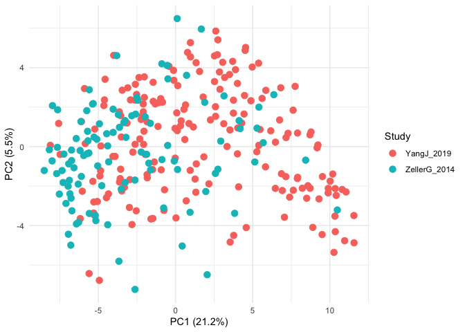

# 0. Setup

Load libraries and count data

``` r
# libraries
groundhog::groundhog.library(c("tidyverse","here"), "2025-10-01")
```

    ## groundhog says: No default repository found, setting to 'http://cran.r-project.org/'

    ## ── Attaching core tidyverse packages ──────────────────────── tidyverse 2.0.0 ──
    ## ✔ dplyr     1.1.4     ✔ readr     2.1.5
    ## ✔ forcats   1.0.1     ✔ stringr   1.5.2
    ## ✔ ggplot2   4.0.0     ✔ tibble    3.3.0
    ## ✔ lubridate 1.9.4     ✔ tidyr     1.3.1
    ## ✔ purrr     1.1.0     
    ## ── Conflicts ────────────────────────────────────────── tidyverse_conflicts() ──
    ## ✖ dplyr::filter() masks stats::filter()
    ## ✖ dplyr::lag()    masks stats::lag()
    ## ℹ Use the conflicted package (<http://conflicted.r-lib.org/>) to force all conflicts to become errors
    ## here() starts at /Users/sxmorgan/Desktop/ds_iai
    ## 
    ## Successfully attached 'tidyverse_2.0.0'
    ## 
    ## Successfully attached 'here_1.0.2'

``` r
# custom functions
source(here("code", "helper_day3.R"))
source(here("code", "helper_day4.R"))

# read in data
meta <- read_tsv(here("data", "metadata_recoded.tsv"))
```

    ## Rows: 294 Columns: 9
    ## ── Column specification ────────────────────────────────────────────────────────
    ## Delimiter: "\t"
    ## chr (6): Sample_ID, Condition, Study, Sex, TumorLoc, FOBT
    ## dbl (3): Age, BMI, TumorStage
    ## 
    ## ℹ Use `spec()` to retrieve the full column specification for this data.
    ## ℹ Specify the column types or set `show_col_types = FALSE` to quiet this message.

``` r
counts_1 <- read_tsv(here("data", "yang_genus_counts.tsv"))
```

    ## Rows: 190 Columns: 855
    ## ── Column specification ────────────────────────────────────────────────────────
    ## Delimiter: "\t"
    ## chr   (1): Sample_ID
    ## dbl (854): Abiotrophia, Absicoccus, Acetatifactor, Acidaminococcus, Acinetob...
    ## 
    ## ℹ Use `spec()` to retrieve the full column specification for this data.
    ## ℹ Specify the column types or set `show_col_types = FALSE` to quiet this message.

# 1. Effect Sizes and P-values

Let’s run some tests and have a look at which features are the most
differentially abundant between case-control groups.

``` r
relab_1 <- counts_to_relab(counts_1) 
relab_1_log <- relab_1 |>
  filter_features(relab_threshold = 0.001, prevalence_threshold = 0.05) |>
  log_transform()
```

``` r
mini_meta <- select(meta, Sample_ID, Condition)

# tidy + group our data frame to make the application of effect size + wilcox functions explicit
df_tidy <- relab_1_log |>
  pivot_longer(-Sample_ID,
               names_to = "genus",
               values_to = "log10_rel_ab") |>
  left_join(mini_meta) |>
  group_by(genus)
```

    ## Joining with `by = join_by(Sample_ID)`

``` r
# generalized fold changes (see helpers.R)
fold_changes <- df_tidy |>
  summarize(fold_change = compute_gfc(pick(log10_rel_ab, Condition)))
arrange(fold_changes, desc(fold_change))
```

    ## # A tibble: 135 × 2
    ##    genus                  fold_change
    ##    <chr>                        <dbl>
    ##  1 Fusobacterium                1.53 
    ##  2 Parvimonas                   0.913
    ##  3 Peptostreptococcus           0.834
    ##  4 Hungatella                   0.823
    ##  5 Allisonella                  0.673
    ##  6 Erysipelatoclostridium       0.581
    ##  7 Porphyromonas                0.476
    ##  8 Alloprevotella               0.471
    ##  9 Clostridium_AQ               0.403
    ## 10 Gemella                      0.389
    ## # ℹ 125 more rows

``` r
# with wilcoxon test -> go check out helpers.R for simple wrapper adaptation
results <- df_tidy |>
  summarize(fold_change = compute_gfc(pick(log10_rel_ab, Condition)),
            p_value = compute_wilcoxon(pick(log10_rel_ab, Condition))) |>
  mutate(p_adj = p.adjust(p_value, method="fdr")) |>
  mutate(significant = ifelse(p_adj <= 0.05, TRUE, FALSE)) 
arrange(results, p_adj)
```

    ## # A tibble: 135 × 5
    ##    genus              fold_change  p_value    p_adj significant
    ##    <chr>                    <dbl>    <dbl>    <dbl> <lgl>      
    ##  1 Fusobacterium            1.53  9.69e-17 1.31e-14 TRUE       
    ##  2 Parvimonas               0.913 1.71e-11 1.15e- 9 TRUE       
    ##  3 Peptostreptococcus       0.834 4.13e-10 1.86e- 8 TRUE       
    ##  4 Fusicatenibacter        -0.981 6.68e-10 2.26e- 8 TRUE       
    ##  5 Ventrimonas             -0.886 4.46e- 9 1.20e- 7 TRUE       
    ##  6 Hungatella               0.823 1.39e- 8 2.73e- 7 TRUE       
    ##  7 Roseburia               -1.06  1.41e- 8 2.73e- 7 TRUE       
    ##  8 Porphyromonas            0.476 4.98e- 8 8.41e- 7 TRUE       
    ##  9 Agathobaculum           -0.749 1.25e- 7 1.88e- 6 TRUE       
    ## 10 Anaerostipes            -0.599 5.44e- 6 7.35e- 5 TRUE       
    ## # ℹ 125 more rows

# 2. Visualizing data: relationships (between effect size and significance)

``` r
p.alpha <- 0.05

results |>
  # first we need to transform the p values...
  mutate(neglog10p = -log10(p_adj)) |>
  ggplot(aes(x = fold_change, y = neglog10p)) +
  geom_point(aes(color = p_adj < p.alpha), alpha = 0.75) +
  geom_hline(yintercept = -log10(p.alpha), linetype = "dotted") +
  labs(
    title = "Volcano plot",
    x = "Effect Size (gFC)",
    y = "Significance (-log10(P_adj))",
    color = "FDR < 0.05") +
  scale_color_manual(values = c("grey","red")) +
  theme_bw() 
```

<!-- -->

Q: What is the meaning of a positive or negative effect size, given the
way we calculated it (by comparing cases to controls at different
quantiles)? Which bacteria are most significantly enriched in CRC, and
how do you know?

# 3. Read in a second dataset

``` r
counts_2 <- read_tsv(here("data", "zeller_genus_counts.tsv"), show_col_types = FALSE)
relab_2 <- counts_to_relab(counts_2) 
relab_2_log <- relab_2 |>
  filter_features(relab_threshold = 0.001, prevalence_threshold = 0.05) |>
  log_transform()
```

# 4. Dimensionality reduction: a global view of both datasets

``` r
common_feats <- intersect(names(relab_1_log), names(relab_2_log))
combined <- bind_rows(select(relab_1_log, Sample_ID, all_of(common_feats)),
                      select(relab_2_log, Sample_ID, all_of(common_feats)))

# Run PCA on log-transformed data
pca_res <- run_pca(combined)

# Join with metadata for plotting
pca_coords <- pca_res$coords |>
  as_tibble() |>
  left_join(meta, by = "Sample_ID")

# Plot
pca_coords |>
  ggplot(aes(x = PC1, y = PC2, color = Study)) +
  geom_point(size = 3) +
  labs(
    x = paste0("PC1 (", round(pca_res$var_explained[1], 1), "%)"),
    y = paste0("PC2 (", round(pca_res$var_explained[2], 1), "%)")
  ) +
  theme_minimal()
```

<!-- -->

``` r
pca_coords |>
  ggplot(aes(x = PC1, y = PC2, color = Condition)) +
  geom_point(size = 3) +
  scale_color_manual(values = c("purple","orange")) +
  labs(
    x = paste0("PC1 (", round(pca_res$var_explained[1], 1), "%)"),
    y = paste0("PC2 (", round(pca_res$var_explained[2], 1), "%)")
  ) +
  theme_minimal()
```

<!-- -->

# 5. Prep for the assignment: Build a volcano plot of the second dataset

``` r
df_tidy <- relab_2_log |>
  pivot_longer(-Sample_ID,
               names_to = "genus",
               values_to = "log10_rel_ab") |>
  left_join(mini_meta) |>
  group_by(genus)
```

    ## Joining with `by = join_by(Sample_ID)`

``` r
# generalized fold changes (see helpers_day4.R)
fold_changes <- df_tidy |>
  summarize(fold_change = compute_gfc(pick(log10_rel_ab, Condition)))

# with wilcoxon test -> go check out helpers_day4.R for simple wrapper adaptation
results <- df_tidy |>
  summarize(fold_change = compute_gfc(pick(log10_rel_ab, Condition)),
            p_value = compute_wilcoxon(pick(log10_rel_ab, Condition))) |>
  mutate(p_adj = p.adjust(p_value, method="fdr")) |>
  mutate(significant = ifelse(p_adj <= 0.05, TRUE, FALSE)) 
arrange(results, p_adj)
```

    ## # A tibble: 230 × 5
    ##    genus              fold_change     p_value    p_adj significant
    ##    <chr>                    <dbl>       <dbl>    <dbl> <lgl>      
    ##  1 Fusobacterium            0.751 0.000000494 0.000114 TRUE       
    ##  2 Peptostreptococcus       0.776 0.0000141   0.00162  TRUE       
    ##  3 Allisonella              0.683 0.000320    0.0124   TRUE       
    ##  4 Anaerostipes            -0.596 0.000475    0.0124   TRUE       
    ##  5 Anaerotignum             0.895 0.000426    0.0124   TRUE       
    ##  6 CAG-41                  -0.613 0.000376    0.0124   TRUE       
    ##  7 Hungatella               0.681 0.000229    0.0124   TRUE       
    ##  8 Parvimonas               0.673 0.000241    0.0124   TRUE       
    ##  9 Porphyromonas            0.380 0.000486    0.0124   TRUE       
    ## 10 Fournierella             0.587 0.000696    0.0143   TRUE       
    ## # ℹ 220 more rows

``` r
results |>
  # first we need to transform the p values...
  mutate(neglog10p = -log10(p_adj)) |>
  ggplot(aes(x = fold_change, y = neglog10p)) +
  geom_point(aes(color = p_adj < p.alpha), alpha = 0.75) +
  geom_hline(yintercept = -log10(p.alpha), linetype = "dotted") +
  labs(
    title = "Volcano plot",
    x = "Effect Size (gFC)",
    y = "Significance (-log10(P_adj))",
    color = "FDR < 0.05") +
  scale_color_manual(values = c("grey","red")) +
  theme_bw() 
```

<!-- -->
